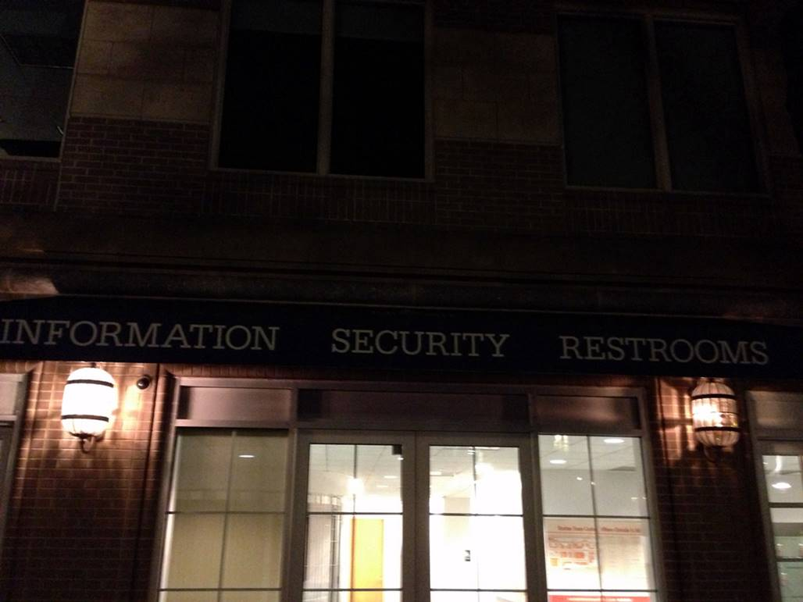
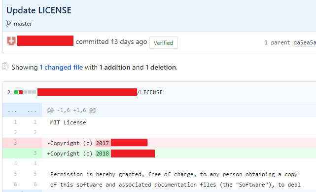
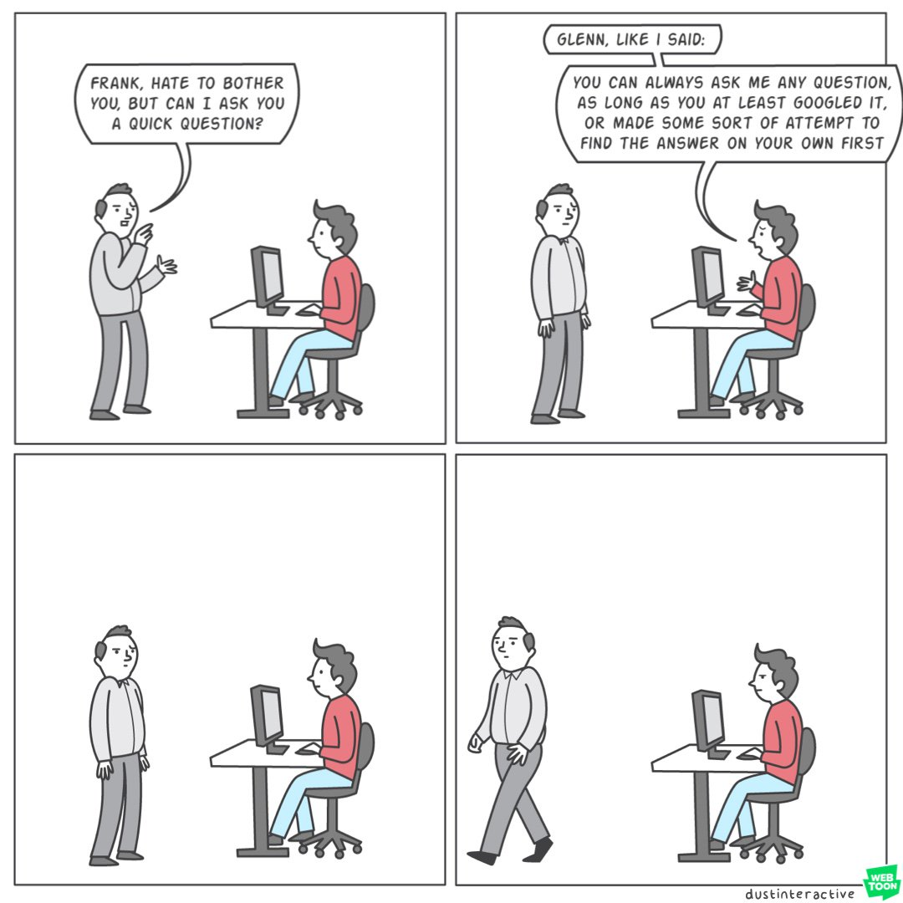

### Information Security Restrooms
Where you go to "dump" you exploits. It's a place in Reston, Virginia.

### You did this? I did this.
Let me just take add my name to your code.

### Rust and Morals
"If you have no morals to not develop new software in Rust and put your clients at risks then go ahead."

### Dhiraj Films Application Security Engineer Job Description
"WE ARE NOT LOOKING FOR A TESTER. LOOKING FOR A JAVA PERSON WHO CAN CODE IN THE APPLICATION SECURITY"

No one knows what "coding in the application security" means.

### Glenn by Dustin Rogers
"Any resemblance to actual persons, living or dead, or actual events is purely coincidental."



### Programmer Beats Mathematician with Facts and Logic
"Is the Fields Medal going to still be relevant in 10 years?"

"It's very likely that the 2028 Fields medal will be awarded to a programmer, not some mathematical super-genius (assuming that the committee is fair, and not biased against machines.)

Source: HackerNews

