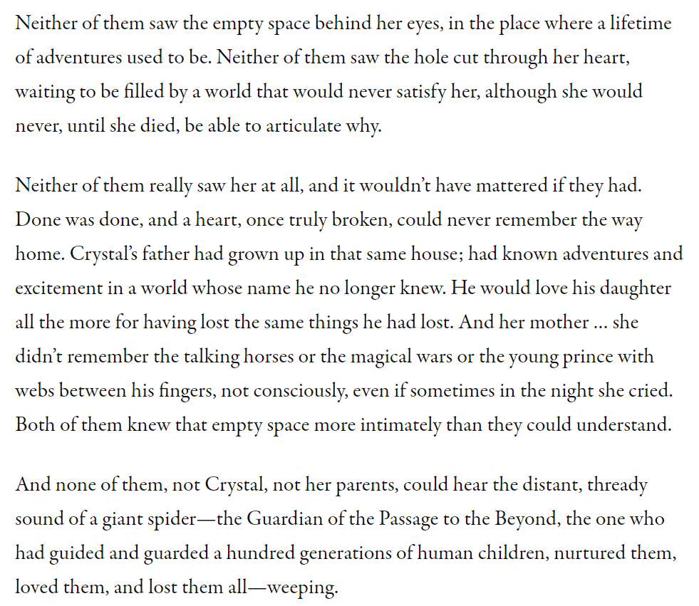

The local public library uses the bibliocommons platform. I've started adding
short reviews for each of the books I've read. You can see most of them at
the bottom of the [book list](). I've tried to write
spoiler-free reviews, but some reviews have minor spoilers.

The titles are
"[author(s)] - [series/collection/anthology (if any)] - [book name] - [finished timestamp] - [score/5]".
DNF == Did Not Finish.

Anthology reviews have three buckets. These are very time-consuming so sometimes
I skip writing them (which is a disservice to both you and me).

* I loved: I usually mention my favorite story, too.
* I liked: Enjoyable stories that are worth reading.
* I didn't like or skipped: This doesn't necessarily mean the story was bad. You
  should at least give them a chance. Although in some cases the story is just
  bad.

## Greg Egan - Zendegi - 5/5 {#zendegi}
Disclosure: I was born and raised in Iran. I liked the book and especially the
parts related to Shahnameh. Not all the Farsi/Persian words used in the book
(mostly in conversations) were translated. I think non-native speakers would
have benefited from it. Greg's short story in [Galactic Empires][galactic-empires]
(see the next item) named "Riding the Crocodile" also uses Persian/Middle-Eastern
elements.

[galactic-empires]: https://www.goodreads.com/book/show/32333734-galactic-empires

## Neil Clarke - Anthology - Galactic Empires - 4/5 {#galacticempires}
Nice collection of stories. I love anthologies because if I cannot connect with
a story after a few pages, I can move to the next story. Fortunately, this only
happened twice with this book (doesn't mean those stories are bad, I just didn't
like them).

## David Drake & S.M. Stirling - The General 01-02 - Warlord - 2/5 {#warlord}
The first two books of the Raj Whitehall or General series. I only finished the
book because I love [David Drake][david-drake]. I didn't like the very
monotonous battles. I guess I am more of a [Hammer's Slammers][slammers] fan
than low tech war.

## Bruce Sterling - Pirate Utopia - 1/5 - DNF {#pirateutopia}
Stopped two short stories in. While I liked the settings, it was more of an
anarcho-sth equivalent of the [Freehold][freehold] series by Michael Williamson
(oh, boy do I have the spicy review for what he has become since then). Not
enough action in the collection of short stories.

[freehold]: https://en.wikipedia.org/wiki/Freehold_(novel)

## Christopher Ruocchio - Anthology - Sword and Planet - 5/5 {#swordplanet}
Good collection of short stories at the intersection of Sci-Fi and Fantasy. I
enjoyed reading all of them. This is a sub-genre that I need to explore more.
Cyborgs in a fantasy setting? Sign me up.

## Ann Leckie - Imperial Radch 01 - Ancillary Justice - 3/5 {#ancillaryjustice}
I enjoyed the book. It has won a laundry list of prestigious awards. While I
loved the main character, the world building took most of the book. It's as-if
the book was written with the intention of being the first in a series. I did
not excite me for the second book (as of September 2023 I've not continued the
series, yet).

## Kevin Anderson - Saga of the Seven Suns 01 - Hidden Empire - 4/5 {#saga01}
Book first in the [Saga of the Seven Suns][seven-suns] series. Most of this book
is world building. This might get boring There are a ton of characters,
factions, and plots. If you like vast space operas, this is the series for you.
I subtracted one star. Because IMO a lot of the world building could have been
done in later books. There was no need to include some minor plots in book one.

Think of this as the Sci-Fi equivalent of [Wheel of Time][wot] series.

[seven-suns]: https://en.wikipedia.org/wiki/The_Saga_of_Seven_Suns
[wot]: https://en.wikipedia.org/wiki/The_Wheel_of_Time

## Ernest Cline - Ready Player Two - 0/5 {#player2}
Cringe central alert! Oh God, where do I start? I am a huge fan of "main
character transported to virtual/parallel/fantasy worlds" (or Isekai in anime
speak), but even the first book (Ready Player One) was bad.

I didn't think it would be possible to cram more 80s references than the first
book, but Ready Player Two did. It's a non-stop vomit. This new book introduces
the concept of "Needlepoints." These are locations in the OASIS that trigger
background music. Every page has at least 2-3 song references played at these
points.

Following the tradition, the new book also has a series of quests. The quests
are very simple. Most of them are handwaved with "I have already done a series
of activities on this planet and have this thingamajig that solves it." At least
3 of them where unnecessary.

## John Scalzi - The Dispatcher 01 - The Dispatcher - 4/5 {#dispatcher01}
## John Scalzi - The Dispatcher 02 - Murder by Other Means - 4/5 {#dispatcher02}
Scalzi writes "Sci-Fi that sells" and I guess I respect that. You gotta earn a
living. Not every book can be [Old Man's War][old-war].

[old-war]: https://en.wikipedia.org/wiki/Old_Man%27s_War_series

Both books are quick and easy reads in the same universe. The universe's premise
is interesting. 999/1000 return to life after unnatural death. The dispatcher
is a state regulated killer. They kill people who are dying so they return to
life.

## Jason Cordova - Anthology - Chicks in Tank Tops - 5/5 {#chickstanks}
Nice collection of SFF short stories with female protagonists and, well, tanks!
The tanks are not always conventional. They're balloons, spring-wired
contraptions, and at least in one occasion, a beloved classic literary
character. I only skipped one story in the book.

There are two stories by my favorite author [David Drake][david-drake]. You
would have expected the stories to be about [Hammer's Slammers][slammers], but
they are not. The tank in the stories is a surprise.

[david-drake]: https://en.wikipedia.org/wiki/David_Drake
[slammers]: https://en.wikipedia.org/wiki/Hammer%27s_Slammers

## Christopher Ruocchio & Sean CW Korsgaard - Anthology - Worlds Long Lost - 4/5 {#worldslost}
I've quickly become a fan of Baen's anthologies (mostly by Chris Ruocchio).

Collection of short stories involving alien archaeologies. It has quite a few
horror stories, ranging from "ancient Gods waking up" to "mind-controlling
aliens." Some others were more relaxed like "we've found an ancient city, let's
extrapolate how the aliens looked like and lived." Some were more adventurous
and followed the footsteps of extinct civilizations.

The only reason it got 4/5: The story by Orson Scott Card really felt out of
place in this anthology. It really didn't have anything to do with ancient
aliens remains or artifacts. I think they just wanted to include a story by a
famous writer.

## Christopher Ruocchio & Tony Daniel - Anthology - Star Destroyers - 3.5/5 {#stardestroyers}
I gave this book 3.5/5 because not all of the stories were really centered on
"ships."

I loved:

* "Superweapon" (disclosure: I am a huge [David Drake][david-drake] fan) and
  "Another Solution" were two of my favorites. Thoughtful and almost zero action
  with the theme of "ships have souls."
* Some were great action/combat stories like "Hate in the Darkness," "Try Not to
  Kills Us All," "Helping Hand," and "Not Made for Us." TBH, the latter's
  connection to a ship is tangential and the setting could have been anything
  else.

I didn't like:

* "Boomers" (ironically, also mirrors the generation mindset) and "Icebreaker"
were a copy of the typical "non-US country bad" online discourse. 
* "Magnolia Incident" was "don't complain about the military taking away your
civil rights because they're the only thing between you and scary aliens and I
added some ships to this story to include it in this anthology."
[Starship Troopers][starship-troopers-novel] did this better.

[starship-troopers-novel]: https://en.wikipedia.org/wiki/Starship_Troopers

## Greg Bear - War Dogs 01 - War Dogs - 0/5 - DNF {#wardogs01}
I stopped on page 130/291. It did not have a lot of action. It takes skill to
make a military sci-fi book boring. Maybe I am more used to the writing style of
Drake, and Dietz.

## Bryan Thomas Schmidt - Infinite Stars: the definitive anthology of space opera and military SF - 4.5/5 {#infinite01}
Great collection of "Space Opera" short stories by some of my favorite writers.
Most are side stories (or in between books) in the authors' established series.
E.g., David Weber's story happens before the Honorverse series. David Drake's
story is about Lt. Leary (RCN series). Lost Fleet story by Jack Campbell and so
on.

If you like this book, read the second volume,
[Infinite Stars: Dark Frontiers]() (review below).

I didn't finish "Imperium Imposter" and "A Taste of Ashes."

## Michael Z. Williamson - Freehold 07 - Angeleyes - 0.5/5 {#freehold07}
Born and raised in an authoritarian Middle-Eastern country, I have a healthy
distaste for government. Williamson is a libertarian and [Freehold][freehold]
is a libertarian utopia. I loved it and appreciated his worldview of "small
folks against big government." I didn't question how the big bad sluggish and
incompetent UN became so powerful. I guess this was before I realized I am more
of a [Mack Reynolds][mack-reynolds] type of "big gov hater."

[mack-reynolds]: https://en.wikipedia.org/wiki/Mack_Reynolds

Most people's problem with this book are the very detailed and graphic sex
scenes. It's a series of soft porn scenes between Sci-Fi. I also think
they were unnecessary, but hey, "sex sells."

I am not sure what has happened to the author since the original Freehold book
because he has turned into the online lolbertarian warrior caricature and a
walking Facebook meme page complaining about the new generation.

I laughed out loud halfway through the book when in the middle of the
interrogation, the torturer said "my preferred pronouns are xir." I didn't
expect a "pronouns in bio" moment and the main character ranting about trans
people. You wanna make a torturer trans, I have no problem with that, but "xir
is a torturer because xir is trans" was hilarious.

There were discussions about how minimum wage, employee benefits (Freehold
businesses went bankrupt because they had to provide benefits, lol), work hour
regulations (UN torturers couldn't work more than 10 hours, lol), government
mandated contracts, and even warnings on tools/appliances are bad. This is
exactly what grandpa on Facebook says. What makes this more hilarious is the
author served 25 years in the US military which has all of this and more. The US
government has all of this (e.g., no-bid contracts).

## Kevin Anderson - Saga of the Seven Suns 02 - Forest of Stars - 5/5 {#saga02}
Book two the [Saga of the Seven Suns][seven-suns]. I liked this one more than
the first because the world building was done and the characters are becoming
more interesting (to me).

## Kristin K. Rusch - Women of Futures Past: Classic Stories - 5/5 {#womenfuture}
I loved this book. There were so many different stories from different
perspectives. I also liked the author introductions before each story. Those
give the reader an idea of what else the author has written. I added so many
books to my "to read" list.

## Janelle Monae - The Memory Librarian: And Other Stories of Dirty Computer - 3.5/5 {#memorylibrarian}
I loved the settings and some of the stories, especially the main story "The
Memory Librarian." "Timebox" was great."Save Changes" was more fantasy than
cyberpunk. I skipped "Nevermind" and "Timebox Altar(ed)" halfway through.

## Charles E. Gannon & Griffin Barber & Chris Kennedy & Mike Massa - Tales of the Terran Republic - Mission Critical - 4/5 {#missioncritical}
This is a book in the "Tales of The Terran Republic Universe" and part of the
"Murphy's Lawless" series. This book is a compilation of three novellas
"Infiltration" (Griffin Barber), "Insertion" (Chris Kennedy), and "Assault"
(Mike Massa) weaved together. Read the other books before starting this.

I deducted one star because this is not known beforehand. You're dropped in the
middle of a fully built universe without much explanation. Some previous events
are explained through the book, but some questions are never answered. Like, who
are even the Harvesters?

There's a lot of text about character backgrounds and their relationships with
the original inhabitants of the system. These are never fully explored because
they're the subject of previous books in the series.

Other than that, the action is fluid and I liked the how book jumped between
the different locations and how everything came together for the final showdown.

## John Ringo - Ghost - 0/5 - DNF
Oh my, where do I start with this. I stopped a few chapters in. Ringo was the
guy whose stories made me realize ~~a not so insignificant~~ a significant
portion of Military Sci-Fi evil aliens are in fact "brown people from the
Middle-East."

The only positive thing about this book is the famous
["Oh John Ringo, No"][ringo-no] meme.

[ringo-no]: https://hradzka.livejournal.com/194753.html

## James L. Cambias - Billion Worlds 01 - The Godel Operation - 5/5 {#billion01}
The universe is set 10,000 years into the future. The billion worlds refer to
the almost innumerable habitats, terraformed planets/moons, and modified
asteroids in the solar system (and a few nearby stars) housing trillions of
biological and digital beings. There are genetically modified humans, dolphins,
Martians, and other species mixed with AIs of different intelligence levels.

The universe offers digital existence, genetic modification, matter printers
(e.g., create almost any matter like food or clothes). Travel is still bound by
physical laws so going around the solar system is slow (and requires
hibernation). There are a few nearby stars that are populated (there's a mention
of ships at half the speed of light).

The story follows a group of characters (mainly a "robot AI" and a human) in
search of a super weapon. I like the universe and Cambias' writing style.

## James L. Cambias - Billion Worlds 02 - The Scarab Mission - 5/5 {#billion02}
Another quick read in the "Billion Worlds" universe. I will not repeat the
description from my last review (see "The Godel Operation" review above). The
stories are not related. There's a recurring character, but that's about it.
This one is centered around an empty habitat and a group of salvagers looking
for valuables.

## James L. Cambias - Arkad's World - 4.5/5 {#arkad}
This is my 3rd consecutive James Cambias book in 2 weeks.

Exciting journey of a group of humans through a strange planet inhabited by
countless species of aliens. I give the world building 6/5 and character
development 3/5. The extensive world building makes sense when I realized he is
a fantasy tabletop game designer.

I especially liked how the author had devised a sort of distinctive grammar and
sentence structure in English for the each species' usage of the planet's
"common tongue" language. My favorite is the Itooti's usage of adjectives based
on the tone of the conversation. E.g., "Curious [Name] wants to know why flimsy
looking aliens [referring to humans] are in civilized [city name]."

Some cons: 2 of the 4 main humans are stock characters and they did not have a
lot of development. A couple of loose ends are not tied.

## John Scalzi - The Kaiju Preservation Society - 3/5 {#kaiju}
It's an entertaining read. Scalzi is honest about writing sci-fi that sells. I
cannot really argue with that, as artists need to eat, too.

## Kevin Anderson - Saga of the Seven Suns 03 - Horizon Storms - 4/5 {#saga03}
Book 3 of the "Saga of the Seven Suns." In the honored tradition of such a big
space saga, we will be keeping up with dozens of "main" characters. I like how
some of the characters are being developed (e.g., the king) and how the Ildiran
society is challenged.

## John J. Adams - Cosmic Powers: The Saga Anthology of Far-Away Galaxies - 4/5 {#cosmic}
I liked most of the stories.

I didn't like "Temporary Embarrassment in Spacetime", "Infinite Love Engine",
"Dragon That Flew Out of the Sun", and "Diamond and the World Breaker."

I loved:

* "The Deckhand, the Nova Blade, and the Thrice-Sung Texts": Story of a reluctant hero told through diary logs.
* "Frost Giant's Data": Cyberpunk infiltration of a security planetoid.
* "Chameleon's Gloves": What makes us human?
* "The Sighted Watchmaker": Why did our creator leave?
* "Zen and the Art of Starship Maintenance" and "Unfamiliar Gods": Variations of "Monkey's Paw."
* "Seven Wonders of a Once and Future World": Time is a flat circle.

## Alex Lamb - Roboteer 01 - Roboteer - 0.5/5 - DNF {#roboteer01}
I stopped halfway through after I saw it's going in circles.

There are two major groups of humanity: The eugenic, augmented and advanced rich
spacers (similar to Asimov spacers) who fled the Earth after the environment was
destroyed. The misogynistic religious earthlings who are waging war against
them. We're supposed to like the spacers. If this was reddit, I would say ESH
(Everyone Sucks Here).

There's even a "they hate us because they ain't us" conversation between two
spacers. This was giving me post 9/11 vibes.

## John Scalzi - The Dispatcher 03 - Travel by Bullet - 4/5 {#dispatcher03}
Another quick and fun read in the Dispatcher universe. Tons of recurring
characters and some new ones. Some cryptocurrency and techbros mixed into the
story.

## Bryan Thomas Schmidt - Anthology - Infinite Stars: Dark Frontiers - 5/5 {#infinite02}
Second anthology in the "Infinite Stars" series (see the previous one above). I
don't think I skipped any stories in this one. [List of stories][l1].

Some of I loved:

* "The Traitor": Set in the Bolo universe by David Weber.
* "Shambleau": Great story. I only skipped it because I had recently read it in
  [Women of Futures Past]().
* "Earthman, Come Home": Man goes back in time to kill humanity's fake masters.
* "Cold Sleep": I woke up in this ship and have no idea what's happening.
* "Rescue Party": Aliens go to rescue a doomed civilization. The last sentence gave me goosebumps.

[l1]: https://bryanthomasschmidt.net/writings/anthologies-edited/infinite-stars-dark-frontiers/

## David Weber & Jacob Holo - Gordian Protocol 01 - The Gordian Protocol - 0/5 - DNF {#gordian01}
Oh God, what did I just read?

If you're a Weber fan, don't read this book. If you don't know Weber, read
another book. He has good series like [Empire of Man][emp-wiki] or his
[Bolo][web-bolo] book.

[emp-wiki]: https://en.wikipedia.org/wiki/Empire_of_Man
[web-bolo]: https://www.goodreads.com/en/book/show/470053

If you're still inclined to read this book, read the prologue (chapter 0).
**SKIP CHAPTERS 1 AND 2**.

Chapter 1 is basically non-stop whining about how the American college is woke.
It's how high schoolers who've never been to college or old folks who were in
college decades ago, think it is. The professor is being silenced!

Chapter 2 is about shooting and how the professor is not a bigot because he has
a gay brother.

As another reviewer on Goodreads had a fun note. You would expect chapter 3 to
be about quartering soldiers in homes or the 3rd amendment because that's how
the other two were, lol.

I am not sure **WHY** I actually read these two chapters. I mean I expect
military science fiction to be full of conservatives, but this sort of
nonsense was just too much. It didn't even have to do much with the rest of the
book. It looked like the authors wanted to rant. The book got better, but when it
has hit rock bottom, the only way is up.

## David G. Hartwell & Jacob Weisman - The Sword & Sorcery Anthology - 4/5 {#swordant}
It had been a while since I had read actual fantasy. This was a breath of fresh
air between all the Sci-Fi and Mil-Sci-Fi.

Loved:

* Tower of the Elephant: Of course, no fantasy anthology is complete w/o Conan.
* Black God's Kiss: Woman goes to hell to get a weapon. Holy shit, the depiction
  of hell gave me goosebumps. I mean, what else do you expect from the author of
  a masterpiece like "Shambleau."
* Undertow: What a surprise ending!
* Barrow Troll: David Drake, yeah! The burden of guarding a treasure.
* Soldier of An Empire Unacquainted With Defeat: Very fun! Not like other
  soldier rehabilitation stories.
* Sea Troll's Daughter: A troll gets revenge after death.

Good:

* Unholy Grail: Grey Mouser gets revenge. The beginning was frustrating, but it
  got much better as the story progressed.
* Tale of Hauk: Helping a disturbed ghost pass into the afterlife.
* Adventuress: Two women go on an adventure. I was very confused by the ending.
  They saw two men from afar and immediately wanted to marry them before even
  meeting them?
* Gimmile's Songs: A magical figurine with a curse.
* Red Guild: An assassing can never be happy because of a curse.
* Path of the Dragon: I am not a Game of Thrones fan, but I liked this story.
  The lady who owns dragons (I don't even remember her name) find an army.

Didn't like/skipped:

* Stages of God: No, not really interesting.
* Epistle From Lebanoi: Skipped after a few pages.
* Become a Warrior: A cliche tale of revenge.
* Six From Atlantis: A stranger went to a royal court and killed a bunch of
  people. I really didn't get the point of the story.
* Coral Heart: Skipped after a few pages. There was a sword or something. Boring!
* Year of the Three Monarchs: Tale of three people who become king by killing
  the previous one. Interesting story, and a great setting but too rushed IMO.

## John Scalzi - Fuzzy Nation - 3/5 {#fuzzy07}
A somewhat reboot of H. Beam Piper's Little Fuzzy. The original work is out of
copy right so you can read it for free in places like
[Project Gutenberg (text)][lf-gu], [Internet Archive (audio book)][lf-aa-audio],
or [standard ebooks (text)][lf-se-text].

[lf-gu]: https://gutenberg.org/ebooks/18137
[lf-aa-audio]: https://archive.org/details/LittleFuzzy
[lf-se-text]: https://standardebooks.org/ebooks/h-beam-piper/little-fuzzy

It was a quick read. The first third of the book was boring, the second third
was amusing, and the last part of the book (and the entire ending) was very very
cheesy and written like fan fiction.

## David Boop - Anthology - Gunfight on Europa Station - 4/5 {#guneuropa}
* [Western stories in space][gunfight]. 
* [List of stories on bibliocommons][gunfight-list].

I loved. These stories were really creative and blended the genres:

* "Greenhorn" by Elizabeth Moon: A new farmer with a hidden agenda arrives in a
  space colony imitating the old wild west.
* "Hydration" by Alan Dean Foster: A lost prospector does an unusual trade.
* "Winner Takes All" by Alex Shvartsman: A commando team is extracting the head
  of the resistance (an AI) from a low-technology zone (great setting).
* "Doc Holliday 2.0" by Will McCarthy: **My favorite story in the book**. A
  company creates a clone of an old western Gunslinger to deal with robbers. The
  clone is coming to terms with his existence.

I liked. Western stories in space. Fun to read but nothing to write home about:

* "Penultimate Stand of Pina Gracchi": A classic "law enforcers break up the
  tyranny in a company town" western tale but in space and with aliens.
* "Seeds": Old farmer sees new technology. This was a bit of a mix for me. I liked
  the setting. People live/farm with low technology like the old western
  frontier in other planets. But the story was cliche.
* "Riding the Storm Out": Recapture a fugitive in the middle of a storm.
* "Claim Jumped": Detective murder mystery in a mining asteroid. I liked how the
  sci-fi elements are mixed with the mystery, but the ending was meh.

I didn't like or skipped:

* "Showdown on Big Rock 27": An unfunny version of "kids bamboozle bad people."
* "Last Stand at Europa Station A.": Are these aliens bad or what?
* "Riders of the Endless Void": Heroes arrive and save people. Despite the very
  cool title, this story didn't even pretend to be a western in space.
* "Incident at Raven's Rift": Standoff with robbers, but on another planet.

[gunfight]: https://www.baen.com/gunfight-on-europa-station.html
[gunfight-list]: https://fvrl.bibliocommons.com/v2/record/S21C1884137

## Michael Mersault - The Deep Man 01 - The Deep Man - 4.5/5 {#deepman01}
This book reminds me of the [Republic Of Cinnabar][rcn] (RCN) series by
[David Drake][david-drake] which is basically "the old British navy in space."
I liked the book and the setting because I am a fan of RCN (and David Drake).
The author has published a sequel, [The Silent Hand][silent-hand].
~~I will update the booklist and this title when the series gets a name.~~ Seems
like the series names is ~~"Myriad Worlds"~~ "The Deep Man Trilogy" (according
to "The" Silent "Hand" book).

The setting is an honor-bound society (people duel when their "honor is taken")
ruled by an emperor. There are of course big families juggling for influence.
There are two types of citizens, demi-cits who are provided by the state and
vested citizens who can do what they want. There are ways to become a vested
citizen, but you face an uphill battle because influential families have the
backing of centuries and influence. There's an example of a new vested citizen
almost losing his life. Every military person is a vested citizen.
Officers can purchase their commissions (kinda). There are aliens (Shapers) who
visit every decade and exchange resources for tech. Ship-to-ship action is
mostly close range.

Saef, the main character is a male vested citizen from an old but poor
traditional family. Very similar to Daniel Leary in RCN who comes from a famous
family but is poor because he's estranged from his rich and famous father.

Inga Maru is a copy of Adele Mundy from RCN. The loyal but badass female
companion with exceptional abilities. The author has a short story named `Flops`
that deal with Inga's background. You can read it for free in
[Baen's 2022 Free Stories][baen-free-2022] (first story).

[rcn]: https://en.wikipedia.org/wiki/RCN_Series
[baen-free-2022]: https://www.baen.com/free-stories-2022.html
[silent-hand]: https://www.baen.com/the-silent-hand.html

## Martha Wells - Murderbot Diaries 01 - All Systems Red - 3/5 {#murderbot01}
This was a quick and entertaining read. An "AI coming to terms with its own
existence" tale. This reminded me of Scalzi's books. If you love him you're
gonna like this series.

## Christopher Ruocchio - Sun Eater 01 - Empire of Silence 3/5 {#suneater01}
I don't know what to think about this book. I picked up the book because I had
recently enjoyed several anthologies edited by the author. I powered through the
first part of the book, loved the second, and got bored and skimmed the last
parts.

The setting is interesting and reminded me of Europe during the crusades. It's
yet another feudalism in space, space opera. Religious organization with an
inquisition branch (with its own weapons) that limits what technology is
available to the masses. An emperor that rules through hereditary feudal lords
living in luxury with manipulated genes to live for half a century. Serfs
generally live in poverty. Slavery is legal.

Faster than light travel is possible, but travel time is still measured in years
between systems so people go into stasis. And of course, a war with an alien
enemy that has been going on for a few hundred years. Allegedly, the settings
was pulled from the [Book of the New Sun][botns] (people refer to the beginning
paragraphs which are tbh very similar among other things).

The author is wordy (maybe because he's an editor?). Almost every other page has
a quote from a real or fictional writer/philosopher. There are a lot of things
that could have been skipped.

My biggest gripe with the book is that same events keep repeating. Does the
author think the readers are stupid and need half a dozen examples of sibling
rivalry and "my parents don't love me" (in the first part) to get the picture?
Or how many scenes of "the chantry are evil" in the last part? Come on :).

Mild spoilers ahead. The book can be divided into four parts:

* Main character is still on his home planet. Bad father, absent mother, violent
  sibling. I did not like this part and just read.
* Moves to a 2nd planet and survives in the streets and the arena. I loved this
  part and couldn't put it down.
* His identity is discovered and he moves to the palace. Love triangle. Not great.
* Encounter with the aliens. Chantry messes it up. I skimmed just to finish the book.

The ending was anti-climactic. I am still going to give the 2nd book a try
(public libraries FTW) and see if it picks up speed. Looks like it's as big as
the first.

[botns]: https://en.wikipedia.org/wiki/The_Book_of_the_New_Sun

## Gene Wolfe - Book of the New Sun 01 - The Shadow of the Torturer 3/5 {#newsun01}
I picked this up because of `Empire of Silence` (the review above).

I am gonna be honest, people praise Gene's writing style. I hated it in this
book. OK, I get it, you wanna put all those religious fables and Latin words in
the book. What are all these D&D-like "random encounters" that do not add
anything to the story (e.g., the gardens)?

I liked the setting. The sun is dying. It's feudal Europe with some existing
advanced technology from the past like portals, flyers, and robots. No one knows
how these things work anymore.

Anyways, I just finished the book and moved to the 2nd.

## Gene Wolfe - Book of the New Sun 02 - The Claw of the Conciliator 4.5/5 {#newsun02}
I am glad I read the first book. This is much better. The pace is faster and the
author actually figured out what they want to do with the main character.

My only issue with the book is the missing gap between the books. At the end of
book one, the main character is with his group. All are gone when the second
book starts. I thought some pages had been removed from the "Shadow & Claw"
edition of the book that I was reading (combines the first two books), but no.
There are some cryptic explanations of the events through the book, and I was
expecting some extraordinary event, but it was very mundane.

But I like the writing style of this book better. The inclusion of stories and
the play reminds me of the [Kalila wa-Dimna][kalila] or کلیله و دمنه, one of my
favorite books in Farsi. The stories in that book are like the movie Inception
or Russian dolls. E.g., the main characters start a story and in the middle, one
says, this is like the story of X. Then the X story starts and in the middle,
one of new the characters says, this is just like Y story, and so on. The
stories go a few layers deep.

In this book, there's only one layer and they're not like "random encounters"
from the first book and actually advance the plot.

I am gonna take a break before reading the 3rd book.

[kalila]: https://en.wikipedia.org/wiki/Kal%C4%ABla_wa-Dimna

## Gardner Dozois - Anthology - Book of Swords - 4/5 {#bookofswords}
Fantasy anthology. https://en.wikipedia.org/wiki/The_Book_of_Swords_(anthology).

Starting from this story I am going to copy my favorite quotes from the books.

I loved:

* "A Long, Cold Trail": Two members of the Council of the Treaty for Safety of
  the World (AKA fight unnatural evil) + an ally try to kill an unruly demigod.
  I loved these characters and wanted more. Fortunately, there is a collection
  of short stories named [Sir Hereward and Mister Fitz]()
  (review below).
* "The Smoke of Gold is Glory": **My absolute favorite story in this book.**
  Four adventurers storm a mountain to kill a dragon and take its treasure.
  Amazing setting and five very interesting characters including the dragon. My
  only regret is not finding the concept art of characters before reading the
  story. Check the middle of this page:
  https://scottlynch.substack.com/p/blame-of-thrones. See my favorite quotes
  from this story at the bottom of this section.
* "The Colgrid Conundrum": Two thieves do a drug heist in an industrial (almost
  steampunk) city. I loved the city and was disappointed to see 
  [the author][rich] has not written anything else there, fortunately he has two
  free short stories with the same characters:
  * [The Delusive Cartographer][carto]
  * [The Mermaid Caper][merm].
* "Waterfalling": The setting has guns, magic, and Gods living among mortals.
  Very nice. I will read more of [Gorel of Goliris][gorel].

[rich]: https://www.beneath-ceaseless-skies.com/authors/rich-larson/
[carto]: https://www.beneath-ceaseless-skies.com/stories/the-delusive-cartographer/
[merm]: https://www.beneath-ceaseless-skies.com/stories/the-mermaid-caper/
[gorel]: https://www.goodreads.com/series/272116-gorel-of-goliris

I liked:

* "The Best Man Wins": Stranger contracts a blacksmith to forge a sword. Twist ending.
* "'I Am a Handsome Man,' said Apollo Crow": Cursed crow(s) tracks down a revolutionary in ancient Rome.
* "The Triumph of Virtue": Detective-ish [Quillifer][quil] story. Assassination attempt at court.
* "The Mocking Tower": Heir to a deceased king tries to steal a sword from a
  magical tower. I didn't like the story, but there's an everchanging tower in
  the story and every page has an exotic description on its new shape in the
  background.
* "The King's Evil": Three adventurers go to a cursed island to recover an
  ancient treasure. The main character has an existential crisis (don't we
  all?). I did not like the story, but the writing was excellent.
* "The Sons of the Dragon": History of the two sons of an emperor set in the
  "Game of Thrones" setting. Reads like a history book. It was full of action,
  but meaningless to me because I have neither read the books nor watched the TV
  series.

[quil]: https://www.goodreads.com/series/267729-quillifer

I didn't like or skipped:

* "Her Father's Sword": Kidnapped villagers return as selfish drones. Girl
  struggles to connect with the soulless husk of her father.
* "The Hidden Girl": 10 year old girl is kidnapped and trained as an assassin.
  She develops a conscious.
  * "We're all thieves in this world of suffering," the nun says, "Honor and
    faith are not virtues, only excuses for stealing more."
* "The Sword of Destiny": Wizard's apprentice is sent to steal a magic sword.
  Runs away instead and takes a detour.
* "Hrunting": Man tries to recover his grandfather's ancient sword that was
  thrown away by Beowulf.
* "When I was a Highway Man": Dueling youth tries to make a living in big city.
  The city of Riverside sounds interesting and is part of the author's other
  books. I didn't like this story, but I am gonna try some of the other books.
* "The Sword Tyraste": Man tries to avenge his family with the help of a magic
  sword. It was an easy read, but very bland.

Quotes from "The Smoke of Gold is Glory"

* "Anyway, I am famous among my friends for having never in my life behaved with
  any particular wisdom." - Tarkaster Crale, thief and storyteller.
* "O King," the dragon murmured, wheezing, and with every breath spilling more
  fiery ichor on the ground, "in all our ten thousand years, we have had but
  four friends, and we have only met them this night."
  * The four friends are the main characters here to slay the dragon and take
    its hoard.
* [Glimraug the dragon]: "[...] The long-awaited wonder comes! True
  death-friend, let our pyre be shared, let us build it now! **To take is not to keep**."
* [Brandgar, the King-on-the-Waves]: "[...] But there is no true glory in
  holding. All that must come in the taking ... and letting go."
* "The point is that it has never been done before," said Glimraug. Another
  treasure pavilion was swallowed by fire nearby. "And it shall never be done
  again. All things in this world are made to go into the fire, Tarkaster Crale.
  All things raise smoke. The smoke of incense is sweet. The smoke of wood is
  dull haze. But don't you see? **The smoke of gold ... is glory**."

## Martha Wells - Murderbot Diaries 02 - All Systems Red - 2/5 {#murderbot02}
## Martha Wells - Murderbot Diaries 03 - Rogue Protocol - 2/5 {#murderbot03}
## Martha Wells - Murderbot Diaries 04 - Exit Strategy - 2/5 {#murderbot04}
The series is popular, but I think it's mid. It's not my cup of tea. The only
reason I am reading them is because they're small books.

The [first book]() was better. I guess
the idea of the a bot that wants to be independent and watches TV series was
fun, but the other three books quickly got boring and repetitive.

A whole lot of dialog is dedicated to the murderbot covering its tracks. A good
20% of the books are "I hacked something, I wiped off my movements from logs,
and so on." I think we get the idea that for some reason this bot can hack
anything and everything. Stations are full of security scanners, cameras, and
bots, but they are hackable with a snap.

Another question is other bots (like the transport ship) don't have governor
modules and can do pretty much any illegal activity they want. People don't like
SecUnits (which have governor modules), but are not afraid of bots or constructs
that do not.

## Martha Wells - Murderbot Diaries 06 - Fugitive Telemetry - 3/5 {#murderbot05}
I read this one before "Network Effect" (which is marked as the 5th in the
series) because chronologically the story here happens after the 4th book (Exit
Strategy).

It's a whodunnit murder mystery. A murder has happened in the station and
murderbot must find the murderer and gain the loyalty of residents. I actually,
liked this book better than the rest mostly because there was not a lot of
words dedicated to "hacking" (see review above).

Better, but still not my cup of tea.

## Timothy Zahn - Icarus Saga 01 - The Icarus Plot - 4/5 {#icarus01}
Pretty good book. Space Opera with a lot of action, extensive universe without a
lot of boring world building.

There are many references and recurring characters to book 0,
[The Icarus Hunt][ica0] (not sure why Goodreads has numbered it 0 instead of 1).
I suggest you read it first. I didn't and I still enjoyed the book. The
references are explained later.

[ica0]: https://www.goodreads.com/book/show/192528.The_Icarus_Hunt

Two former bounty hunters turned surveyors are tasked with surveying a planet,
but of course the plot makes them go back to doing what they're good at, finding
people. The book's universe is huge with multiple alien species. An alien race
dominate faster than light travel and an alliance of others including humans
are competing for domination through economic and clandestine warfare.

I really appreciated how the author didn't have extensive world building
chapters and instead kept the action going on. The last third of the book is a
bit repetitive especially the part were the good people outsmart the bad folks,
and the ending is somewhat cheesy. But I guess it's not space opera if the good
people don't win.

I will probably read "The Icarus Hunt" before moving to the next book in this
series.

## David Drake - Time of Heroes 01 - The Spark - 5/5 {#heroes01}
Unfortunately, [David Drake][drake] passed away recently. I had mostly read
short stories by him in the last few years. I mostly reread
[Redliners][redliners] (DRM-free digital format is free on Baen's website), or
Hammer's Slammers. For the last few years, I used to send him actual snail mail
for his birthday and he would reply via email. This year he didn't and it
turns out he wasn't feeling well.

[drake]: https://david-drake.com/
[redliners]: https://www.baen.com/redliners.html

I had not read them before, so I picked up the three books in the "Times of
Heroes" series from the local public library for holiday reading. I gobbled the
book in less than a day.

2023-2024 holiday reading list courtesy of the local public library:

I really love the world. There's "the road" that people can use to travel
between nodes. I think it's like a long portal because it's mentioned while it
has light, you cannot see the sun there.

Nodes are (usually isolated) parcels of land where people can live and is part
of "Here." Monsters and magic items are in "Not-Here" (obviously). In between
these we have "The Waste" which humans can traverse for a bit with the help of
their animal companions with a mental link. Most main characters have one. This
mental link allows them to see through their senses. Our champion has a dog
and fights through his eyes with added agility and reaction time.

The series is an Arthurian fantasy in a far future world. Champions fight with
energy swords and shields. The ancients have left "magical" items that people
can reshape or reuse. Is it advanced technology or magic? Doesn't matter, you
know the famous quote:

> Any sufficiently advanced technology is indistinguishable from magic.
> 
> Arthur C. Clarke

The people who can modify these magical items and reshape them are called
"Makers." They go into a trance and can see and modify the molecular structure
of an artifact to change it. This usually needs extra trace elements (e.g., Iron
or Silicon). Our champion is both a maker and a fighter. We even see some boats
with limited sentience and they can be used to travel between nodes. The boats
are self powered, look like an enclosed cigar, and are airships (I figured this
out after looking at the cover for the 3rd book.)

The story has a huge gaping hole. I am going to try and not spoil it. Pal
acquires his first kingdom and castle. In the kingdom there's an ancient
artifact that acts like an all-seeing eye. You think of anyone and it will give
you a live feed of them and their immediate surrounding. The artifact is never
used. In the last part of this book Pal nearly dies because a certain person is
missing. No one, including Pal thinks of using this artifact to locate that
person.

## David Drake - Time of Heroes 02 - The Storm - 4/5 {#heroes02}
I was disappointed with this book which was a first for me as a huge David Drake
fan.

Although most series repeat some background information from previous books,
this ones has too much. Pal (the main character) keeps repeating how he was a
peasant, how he created his original crap equipment, how his current sword and
shield are great, how makers work to restore/reuse artifacts, and how the road
works.

The major plot in this book is also another missing person. Again, no one thinks
of using the all-seeing eye artifact from the previous book to look for them.
What was the reason for even including the artifact originally?

The main quest in this book is also abandoned for quite a while. Pal goes around
and does side quests while there's no progress on the main quest. I mean, this
is the typical open world RPG tabletop or videogame, but still.

It's shorter than the previous book. I borrowed the hardcover versions from the
library. The first book is 340 pages and this one is 280. The next book is
considerably shorter.

## David Drake - Time of Heroes 03 - The Serpent - 3/5 {#heroes03}
This is my least favorite Drake book. The disappointment continues. The length
of the book is again, smaller. From 340 pages in the first book, to 280 in the
second, and finally 180 pages here (these are all hardcover editions I borrowed
from the public library).

Of course, the redundancy continues. Yes, Pal was born a peasant, doesn't like
the court, his past equipment was crap, his current equipment is great, he can
predict attacks with his dog, he has a boat, and so on. There was no need to
mention these multiple times during the book.

This book doesn't have a main quest or major plot. It's easier to think of this
book as a series of short stories in that setting. I guess that's why there's
excessive repeating. Each story needs to mention some of the background info.
Unfortunately, the plots of stories are kind of similar. Pal goes to some node
to solve a conflict, ends up killing the ruler (through no fault of his own,
lol) and takes over the node for the commonwealth (and reluctantly pockets half
of the taxes).

One of the stories introduced an interesting concept. A female maker.
Unfortunately, the character appears in only one story and very briefly.

Another disappointing point for me were the artifacts. So many amazing artifacts
were introduced by the end of the third book, but most of them (like the
all-seeing eye) were never used or mentioned.

There are a lot of loose ends in this book. I think Mr. Drake (whom I admire a
lot) cut the book short in half due to health reasons. Anyways, his passing a
big loss and I wish he had been able to complete this book properly.

## Garth Nix - Sir Hereward and Mister Fitz - 5/5 {#fitz}
Sir Hereward is an artillerist, swordsman, and pistol wielder. He reminds me of
the famous Alexandre Dumas' musketeer, d'Artagnan. He is dashing, gallant,
easy going, and a womanizer.

Mister Fitz is a sorcerer puppet and the logical part of the duo. He comes up
with the plans, and uses magical needles to perform his sorcery.

They both work for the the Council of the Treaty for Safety of the World. This
council was created to dispatch evil godlets (extra dimensional creatures) and
keep the world safe.

I loved this dynamic duo in the [Book Of Swords]()
story "A Long, Cold Trail" (review above). I was delighted to see that all of
their short stories (and a new one).

The book also has a map of the world. It's not essential to the stories, but a
nice thing to be able to see the cities mentioned in the stories.

* "Sir Hereward and Mister Fitz Go to War Again": Taking down a godlet that is
  siphoning the wealth and energy of nearby cities.
* "Beyond the Sea Gate of the Scholar-Pirates of Sarskoe": The duo join a band
  of pirates to take down an evil being.
* "A Suitable Present for a Sorcerous Puppet": Sir Hereward tries to find a
  birthday present for Mister Fitz and gets involved with yet another evil
  godlet.
* "Losing Her Divinity": This story is narrated by a writer being interrogated
  by Hereward and Fitz. He had encountered a godlet who wanted to be human.
* "A Cargo of Ivories": The duo tries to steal a bunch of ivories from a wealthy merchant.
* "Home is the Haunter": The duo reaches a castle that is getting ready to
  welcome an evil godlet for a night of festivities.
* "A Long, Cold Trail": Hereward, Fitz, and an ally take down a godlet in the snow.
* "Cut Me Another Quill, Mister Fitz": The duo are looking for an elusive dragon.
* "The Field of Fallen Foe": Mister Fitz sticks to his moral compass when he is
  tasked to take down a benign godlet.

## Preston Grassmann - Anthology - Out of the Ruins - 3/5 {#outofruins}
Out of the Ruins: The apocalyptic anthology.

I loved:

* The Green Caravanserai: Post-apocalypse desert. People scavenge for weapons
  and technology.
* Watching God: Really interesting setting. People stuck in the Iron Age living
  on a secluded island. Strange ships arrive from over the horizon and stay
  offshore. Open-ended story.
* Mr Thursday: A time agent tries to keep a girl from getting killed. I liked
  the story, but it's in the wrong collection.
* Endless Fall: My favorite story of the collection. The title is very clever.
  Astronaut wakes up in the forest with no memory. Tries to survive. It might be
  an alien experiment. The author has a book "The Endless Fall and Other Weird
  Fictions" and I will definitely read.
* How the Monsters Found God: Excellent story. A group of sentient machines and
  weapons rediscover their humanity.

I liked:

* Exurbia: Interesting concept. Someone falling through different levels of a
  city and remembering memories.
* Rise and Fall of Whistle-Pig City: A group of posthumans rediscover the
  concept of cities and create one populated by anthropomorphized whistle pigs.
* Like the Petals of Broken Flowers: People defeat usurper Gods.
* Dwindling: A person keeps dying and gets reincarnated as others. Keeps and
  revisits their memories. While a decent story, it's in the wrong collection.
* Maeda, the Body Optic: A plague is turning men into machines.

I didn't like or skipped:

* Age of Fish, Post-flowers: A bunch of people trying to survive the apocalypse
  in a building.
* Storm in Kingstown: A lady goes missing, and there's mention of ancient
  technology (e.g., radio).
* As Good as New: Halfway through the story I realized I had read it before
  (maybe on Tumbler?). Girl meets a genie in a post-apocalyptic world and tries
  to come up with perfect wishes that avoid a Monkey's Paw situation.
* Reminded: I liked the concept, but the story was boring. A plague has erased
  the memories of people. A couple keep reminding each other.
* Splendor and Misery of Bodies, of Cities: I honestly didn't get what the story was about.
* Man You Flee at Parties: DNF. What even was that?
* Malware Park: I was excited to read a cyberpunk story, but DNF. The writing
  style is not for me.
* Inventory: In the wrong collection. Diary-like memory snippets of someone's
  interactions with different people, mainly lovers.

## Gordon Van Gelder - Anthology - Welcome to Dystopia - 3/5 {#welcomedystopia}
Collection of very short stories about future dystopias. The idea of the book
was decent and having very short stories was a new experience. Unfortunately, I
was turned off by the book and at some point stopped reading.

The stories hit too close to home.

William Gibson has a quote "The future is already here, it's just not evenly
distributed." If I could paraphrase, "The dystopia is already here, it's just
not evenly distributed." 

If you know me and my background, you know why I've lived some of the stories.
Why I moved to Canada (and I am Canadian as of a few weeks ago) almost exactly
one year after naturalizing as a US citizen.

Some of the stories I really didn't like, but maybe that was again because they
were too depressing.

## Michael Mersault - The Deep Man 02 - The Silent Hand - 4/5 {#deepman02}
This is the second book in the "Deep Man" series. The first one was, well, "The
Deep Man" (review is further above). I like both characters. This book was
mostly about Inga's character development. I liked the flashbacks that showed
Inga's training and backstory. Some is repeated from the short story `flops` in
[Baen's 2022 Free Stories][baen-free-2022].

The first 2/3rds of the book were OK, but not great. I liked the parts about the
ground combat on the planet. But my absolute favorite was the all out combat in
the last quarter of the book.

Both Saef and Inga are on both books' covers. In this book, both have suddenly
become "hawt." Saef is now more attractive and Inga has supermodel proportions.
Nothing wrong with attractive characters, but it's a huge contrast compared to
the first book. You can see them side by side here:

## Paula Guran - Anthology - Ex Libris - 3/5 {#exlibris}
Collection of stories about libraries. I'd never read a book like this so the
concept was intriguing. The introduction lists some related books that I am
going to try, too.

I loved:

* "In the Stacks": **This is my favorite story of the book**. A group of
  magicians fight their way through a magical library to retrieve/return books.
  Awesome setting. Scott Lynch also wrote "The Smoke of Gold is Glory," my
  favorite story from [Book of Swords]().
* "In Libres": Two students have to venture into a dangerous library (it's a
  labyrinth) to retrieve books. Similar to "In the Stacks" (by Scott Lynch), but
  not as much action. I didn't know that, Elizabeth Bear, the writer of this
  story, and Scott are married.
* "Exchange": Soldier returning from a war relives childhood memories in his
  hometown's library.
* "Summer Reading": Very nice short story. A robot maintains an abandoned
  library on Earth. Gives away a physical book to a visiting child.

I liked:

* "Books": Post-apocalyptic setting. Kids encounter a library and steal some
  books.
* "Paper Cuts Scissors": Librarian's girlfriend has put herself in a book. He
  goes to a mansion where the book characters come alive at midnight to save
  her.
* "Magic for Beginners": I loved the setting and the story, but didn't
  understand the ending (read it twice). A kid and his friends are fascinated by
  a pirate TV show "The Library." He and his mother go on a cross-country trip
  to Vegas and kinda end up in the same show? Maybe the show and his friends
  were all part of his imagination?
* "What Books Survive": Alien invaders have arrived. People live in barricaded
  town. Teenage girl sneaks out to get books from the school. Turns out the
  aliens were after knowledge and didn't want to kill humans.
* "Librarian's Dilemma": Should we destroy overly racist/evil books?
* "If on a Winter's Night a Traveler": A secret society dedicated to keeping the
  identity of a poet anonymous. They admire and publish her work (one poetry
  book), but destroy all mentions of her name.
* "Sigma Structure Symphony": Interesting concept. A librarian is studying the
  transmissions of faraway galactic civilizations and it turns out some of them
  are actually sentient AIs. She designs a way to convert mathematical theorems
  to music, but the alien AI wants more.
* "Last Librarian": Nice premise. A librarian thinks humanity doesn't deserve
  books because it's not civilized anymore. They destroy technology (think like
  an EMP bomb) and go away with the books. Kinda similar to "Fort Moxie Branch."

I didn't like or skipped:

* "In the House of the Seven Librarians": Infant grows up in a magic library.
  It's nice a story, just not my cup of tea. I was expecting the library to turn
  out to be a simulation in the end.
* "Death and the Librarian": I couldn't really connect with the story after a
  few pages and didn't finish.
* "King of the Big Night Hours": I read this (and some pages twice), but I
  didn't get it. A few students commit suicide at the library and things became
  weird.
* "Those Who Watch": DNF after a few pages.
* "Special Collections": DNF after a few pages.
* "Inheritance of Barnabas Wilcox": This story didn't have a real connection to
  a library. The main character is hired by his former highschool bully to
  catalog the books in his new inheritance. It turns out the whole premise was a
  spell for the recently diseased to live through the body of the bully and the
  inheritance was just a ruse.
* "Midbury Lake Incident": A witch librarian is running away from magical
  adversaries who want to get the secrets to the old library of Alexandria. Her
  current secret identity in this story is also a librarian.
* "With Tales in Their Teeth, From the Mountain They Came": Soldiers want to
  destroy a library. The librarians become the books (as in the books are
  written on them) to save them.
* "Green Book": Thoughtcrime of a librarian in an authoritarian theocracy.
* "Woman's Best Friend": Only nominal connection to a library. A women
  encounters a man sent to her world. The premise is infinite parallel worlds.
* "Fort Moxie Branch": Aliens preserve the unpublished works of authors. They
  think we do not deserve them until we've reached a certain level of
  enlightenment.

## Sean Patrick Hazlett - Anthology - Weird World War IV - 4/5 {#www4}
World War 3 has happened. In some cases, the nukes flew and the civilization has
been destroyed, and in other cases some nukes were used, and in the last, no
nukes. These short stories are about World War 4.

Most stories assumed WW4 is happening soon after WW3 and is fought by humans.
"Chaos Redeemed," "Mea Kaua," and "Lupus Belli" had new species.

I loved:

* "Deep Trouble": The US is losing the war and some people decide to wake up
  something ancient. I did not expect the ending. Nicely done.
* "Reflections in Lizard-time": Two groups of aliens from a parallel Earth and
  rekt humans in WW3. But it looks like WW4 will be worse.
* "Chaos Redeemed": An artificial soldier construct is sent to kill some
  indigenous rebels. She realizes the truth about her creation.
* "Mea Kaua": Almost all humans died in WW3. Four sentient AI have created their
  own creations. A mercenary is hired to move a floating city.
* "Eureka Alternative": China has nuked the US. A secret US program is sending
  soldiers into alternate timelines to find a weapon to win the war. A soldier
  and herself from a different timeline find a possible solution.
* "Future and Once": Written in the form of a play. Merlin (from the Arthurian
  legends) and a soldier traverse the aftermath of WW3.

I liked:

* "Big Whimper (the Further Adventures of Rex, Two Million CE)": Aliens
  destroyed humans in WW3, a robot dog is out for revenge after two million
  years.
* "We Are Not Monsters": Interesting concept. Person discovers corporations have
  become sentient.
* "Twilight of the God Makers": Humanity created monsters to win WW3, but is
  losing its grip on them.
* "Door of Return": A group of Africans try to reclaim their magic to change the future.
* "Offering the King Makes": A group of soldiers go into the Egyptian after-life
  looking for weapons to win WW4 and meet some ancient mythological figures.
* "Astral Soldier": As a result of a new weapon used in WW3, some people can
  do astral projection. A group of American soldiers is trying to pacify Panama
  from rebels. The concept was interesting, I wish the story had more action.
* "Wave Forms": Everyone got some sort of magic and the world changed (that's
  supposedly WW3). Powerful magic users rule city states. A person whose magical
  ability is living in a different body every day, is recruited into the
  resistance.
* "Ancient-enemy": Neanderthals have returned from beneath the surface to take
  their revenge. A group of human prisoners put up some resistance.
* "Day in the Life of a Suicide Geomancer": WW3 has destroyed most technology,
  but magic has resurfaced. Necromancers threaten the world. A native American
  ritual destroys the undead and revitalizes the Earth.

I didn't like or skipped:

* "Transformation Problem": A group of people have fled Earth in a spaceship.
  Space anomalies start to pop-up along their route.
* "Triplicate": Williamson is whining about the "woke" again. DNF. I had learned
  my lesson so I stopped at the end of the first page instead of wasting my time
  like I had with [The Gordian Protocol]() and
  [Angeleyes]().
* "Portals of the Past": Time travel, young Hitler, and changing the past.
* "Line in the Stars": WW3 resulted in two major groups. Advanced orbitals and
  people on Earth. A group of soldiers infiltrate an orbital to prevent WW4.
* "Lupus Belli": Some people have become werewolves in WW3. They are 2nd class
  citizens. Convicted werewolves are sent to the moon for their sentence. A
  group of aliens arrive to conquer the Earth.
* "Blue Kachina": A group of soldiers visit a derelict Chinese spaceship on an
  asteroid. Something horrific is inside.

## Jeff Somers - Avery Cates 01 - The Electric Church - 3.5/5 {#electricchurch}
It's a western book in a cyberpunk setting. There's a fair amount of gunslinger
action in the book. The main character doesn't use any augmentations and the
augmented are usually easily defeated by the protagonists. 

The "Joint Council" rules the Earth with an iron first. The "System Cops" are
the ultimate authority. Most people live a desperate life of poverty and die
young. The main character mentions many times that at 27 years old, he has lived
too long.

There's a new religion, the electric church. The converts are turned into cyborg
monks. Rumor has it most of them were converted unwillingly and inside each monk
is a screaming human brain unable to get out.

The main character, Avery Cates is a gunner (AKA gun for hire). He is hired to
kill the head of the electric church.

This is the first of a series of 5 books and many short stories. I liked the
book enough that I will try the next book named "The Digital Plague."

## Sean Patrick Hazlett - Anthology - Weird World War III - 3/5 {#www3}
Collection of stories about how a World War 3 could happen. A lot of stories
revolve around the US and USSR fighting either in alternate history or using
magic/supernatural weapons. A lot of decent stories, but nothing to write home
about.

I loved:

* "Shadow Rook Red": The US and the USSR are fighting on both Earth and a shadow
  realm. People can go from one to the other quite easily with a "toggle
  device." An expert in the other world is kidnapped.
* "Ouroboros Arrangement": What if Earth had a guardian angel that prevented catastrophes?

I liked:

* "Price": Decent David Drake story. The US and the USSR are fighting. Both
  sides are using shamans.
* "Where You Lead, I Will Follow: An Oral History of the Denver Incident":
  Interesting concept. People are addicted to an app that gives them rewards for
  performing tasks. The app causes a catastrophe by telling a large group of
  people to performing small independent tasks.
* "All Quiet on the Phantom Front": The NATO and the USSR are fighting. The
  soviets are winning by using magic. A group of NATO officers try to locate
  missing soldiers.
* "Anastasia's Egg": I liked the story but it had nothing to do with WW3. It
  turns out a few historical figures are magic users and Earth wars/revolutions
  are proxy wars between them.
* "Tap, Tap, Tapping in the Deep": Two US deep divers are trying to tap a soviet
  undersea cable. They encounter a hostile creature made of magic and tech.
* "No Plan Survives First Contact": The soviets have advanced alien tech. Two
  American soldiers try to steal some.
* "Thing Worth a Damn": California is now a socialist republic dependent on the
  USSR (lol). A soviet soldier is tasked with extracting a scientist with a big
  secret.
* "Deniability": The US and the soviets kill assassinate the other side's heads
  of state via supernatural means. Things get out of hand.

I didn't like or skipped:

* "Third World War": It was a joke story, but it was not funny.
* "Last Chance": You don't like capitalism because the soviets are mind-controlling you.
* "Oderzhimost'": A soviet AI is created based on a girl. An American soldier cheated on her.
* "Scholomance": An ancient secret Russian institute is experimenting with the supernatural.
* "It's a Mud, Mud World": Two AIs are launching nukes. Some people try to show
  them the movie "War Games" so they reconsider.
* "Evangeline": The US government is trying to use and recruit people who can
  sense others, with bad results.
* "Bleak Night at Bad Rock": DNF. Turks and Cypriot Communists and Nationalists
  are fighting. There's also a big wolf.
* "Zip Ghost": DNF. The US and USSR are fighting. A group of Soldiers are
  injected with Syphilis and drugs to go to the other side and fight.
* "Second Front": The US and soviets have nuked each other on Earth. Both have
  colonies are on the moon. A group of aliens arrive and clash with the
  colonists.

## Gene Wolfe - The Sorcerer's House - 4.5/5 {#srchouse}
I was hesitant to pick up another Gene Wolfe book after stopping in the middle of
the 3rd book of the new sun (The Sword of the Lictor).

The book is written in the form of letters. I didn't know before, but this type
is called [Epistolary novel][epis-wiki].

Baxter inherits a haunted magical house. The house is connected to a different
world. New characters arrive into the story with accelerated frequency. There
are wizards, sorcerers, werewolves, foxes, vampires, and more.

It was a fun and quick read. Baxter is no Severian (main character of the Book
of the New Sun series). Although, he is a womanizer and in great Gene Wolf
tradition, an unreliable narrator (you will notice missing or wrongly described
events).

[epis-wiki]: https://en.wikipedia.org/wiki/Epistolary_novel

## Sean Wallace - Anthology - The Mammoth Book of Steampunk - 3.5/5 {#steam}
Big steampunk anthology. I did not skip any stories in this book.

I loved:

* "Cinderella Suicide": **My favorite story of the book.** Convicts are sent to
  Australia to harvest extraterrestrial ores. Three of them are sent to find the source.
  * This story reminded me of the "deCom" mercenary crews in [Woken Furies][woken-furies]
    (the 3rd book of the 'Altered Carbon' series). The crews were paid to destroy
    sentient machines on an island. That was a favorite part of that book for me
    and unfortunately, did not appear in the Netflix adaptation. Honestly, a series
    of books about these deCom crews battling sentient machines would be awesome.
* "The Steam Dancer (1896)": How a dancer with augments survived a city alone and how she found love there.
  * Quote: "*Machines break down*, she thinks, *and the flesh is weak. Ain't nothing yet conjured by God nor man won't go and turn against you, sooner or later*.
* "The Mechanical Aviary of Emperor Jala-ud-din Muhammad Akbar": This story
  reminded me of stories in [Kalila wa-Dimna][kalila]. A couple of intertwined
  fables about greed.
  * "He did learn, that young ruler. He learned whom to trust, and whom
    to heed, and that the two are not always the same."
* "Prayers of Forges and Furnaces": The old gods have been defeated by the
  god-machine. One of them returns.
  * "All gods are cruel, Xochipil. What else did you expect?"
* "The Armature of Flight": A rich youth's (Leo) poor boyfriend (William)
  sacrifices himself to make enough money so they can run way. The youth
  squanders the chance away and regrets it for the rest of his life.
  * "William reached up, took Leo's hand in his, squeezed, hard. 'Someday you'll
    let yourself have what you want,'"
* "Numismatics in the Reigns of Naranh and Viu": A queen is disposed by her
  brother. She travels around and gives away the secret of creating steam to the
  populace. The revolution's propaganda is spread through coins.
* "The People's Machine": In an alternate steampunk universe South America is
  not colonized, but North America is. An inquisitor from South America travels
  north to solve a mysterious crime.
  * "An insurrection, guided by machine, could be imminently useful."
* "A Serpent in the Gears": A group of scientists encounter a cyborg serpent from an abandoned civilization.
  * You can also read the story here in [Beneath Ceaseless Skies or BCS #34][bcs34]
  * I liked the characters. They also appear in short story [Salvage - BCS #77][bcs77].
  * Another good short story by this author in a fantasy/steampunk world, [Letters of Fire - BCS #69][bcs69]
* "The Ballad of the Last Human": In a post-human society animals are sentient.
  A dog and a spider embark on a journey to find the last human.

[bcs34]: https://www.beneath-ceaseless-skies.com/stories/a-serpent-in-the-gears-by-margaret-ronald/
[bcs77]: https://www.beneath-ceaseless-skies.com/stories/salvage-by-margaret-ronald/
[bcs69]: https://www.beneath-ceaseless-skies.com/stories/letters-of-fire-by-margaret-ronald/
[woken-furies]: https://en.wikipedia.org/wiki/Woken_Furies

I liked:

* "Fixing Hanover": An inventor has run away from his past and taken refuge in a remote village. It catches up to him.
  * Quote: "Suffering's going to come to everyone someday." – The Willard Grant Conspiracy
* "Icebreaker": A lady travels to the south pole to discard the corpse of his
  late and beloved husband. Adventure ensues.
* "Tom Edison and His Amazing Telegraphic Harpoon": A steam train in the wild
  west is attacked by biblical giants. Can a couple of esoteric inventors defeat
  them with technology?
* "The Effluent Engine": A Haitian goes to New Orleans in search of a scientist
  for a formula. While I liked the story and the setting, it looked like the
  author just added a couple of zeppelins to the story to make it steampunk. You
  could replace them with spaceships and make it sci-fi.
* "The Anachronist's Cookbook": A young girl tries a workers' revolution in a future steampunk Britain.
  * "Jane Sallow did not vanish from the face of the earth – no mortal is
    granted that power. But no reliable record of her exists after her arrest ..."
* "The Hands That Feed": A pawn shop owner hires an immigrant worker. The worker
  gets involved in a criminal conspiracy.
* "To Follow the Waves": A girl can create dreams by weaving them into gems. But
  the other people in the dream also experience it.
* "Reluctance": In post civil war US, post is delivered by dirigibles. A postal
  worker reaches a zombie-infested city.
* "Arbeitskraft": Friedrich Engels tries to free cyborg matchstick girls, but there's a twist.
* "To Seek Her Fortune": A lady explorer spends all her life trying to find the
  cause of her death in order to save her son from it.

I didn't like:

* "The Zeppelin Conductors' Society Annual Gentlemen's Ball": Zeppelin
  conductors mostly live in the Helium balloon. As a result their bodies change.
  Their hands and legs are longer. This is a series of stories about how they're
  discriminated against and how people think they're lunatics.
* "Clockwork Fairies": A minister's rich fiance is a tinkerer. She runs away
  from him to another world and leaves him an automaton instead.
* "The Clockwork Goat and the Smokestack Magi": A fable about why hoarding knowledge is bad.
* "Zeppelin City": Minds removed from bodies are governing a city. They want to destroy all humans.
  * "It followed that the victory would belong to him who was calmest, who shot
    best, and who had the cleverest brain in a moment of danger." Baron Manfred
    von Richthofen (1892–1918)
* "Machine Maid": A colonial lady alters an automaton maid to kill her husband.
* "Clockmaker's Requiem": In a dreamworld, clocks tell their own time instead of a standard one.
* "Dr Lash Remembers": A plague is ravaging through a city. Victims hallucinate fantasy.
* "Lady Witherspoon's Solution": A group of aristocratic ladies inject criminals
  with a serum that turns them into neanderthals. A couple experiment with the
  opposite serum in hopes of becoming smarter.
* "The Celebrated Carousel of the Margravine of Blois": A woman wants to revive
  her dead lover as an automaton.
* "Biographical Notes to 'A Discourse on the Nature of Causality, With
  Air-planes' by Benjamin Rosenbaum": An scholar tries to catch an assassin on a
  zeppelin airship.
* "Clockwork Chickadee": Yet another fable about greed.

## James L. Cambias - Corsair - 3.5/5 {#corsair}
This is Cambias' second book. The world building is decent as usual. Helium 3 is
harvested on the moon and sent to the Earth with rockets. There are pirates who
steal these payloads by using satellites to hack these rockets on the way to the
Earth. The hacked rockets are diverted to remote locations where pirates unload
the Helium 3 and disappear.

A US military officer is trying to catch such a pirate who used to be his old
lover. The pirate is hired by a shady Middle-Eastern Colonel to hijack another
payload. The bad guy is most likely Iranian because his cover last name is
"Ghavami."

The characters were not great (again, usual for Cambias). Although, they have
gotten a lot better in his more recent books especially "The Billion Worlds"
series (read the reviews of two books in that universe above).

## Rhonda Parrish - Anthology - Clockwork, Curses, and Coal - 2/5 {#clockwork}
Quick and easy steampunk short stories.

I loved:

* "Checkmate": **My favorite story in this book.** In an steampunk alternate
  universe, battles are fought by 16 representatives from each side. Each
  fighter is a chess piece (e.g., 8 pawns, 2 knights). An English Knight battles
  a Russian Rook for London.
* "The Giant and the Unicorn": A nice story. A mechanical unicorn saves a giant from madness.
* "The Coach Girl": Steampunk retelling of [The Goose Girl][goose-girl] fable. A
  rich girl is on her way to an arranged marriage. The driver of her coach
  forces her to swap places.

[goose-girl]: https://en.wikipedia.org/wiki/The_Goose_Girl

I liked:

* "Necromancy": A story based on the Pied Piper of Hamelin. A village starves
  and kills their girls that want to leave the village and see the world. Seven
  brothers arrive and promise to help the village with its rat problem, but they
  end up seeking justice for the murdered and imprisoned girls.
* "Blood and Clockwork": The court tinker is in love with the prince. She turns
  herself into a clockwork soldier to serve the king against assassins, but her
  body has been backdoored!
* "Sappho and Erinna": A convict is hired to spy on the Governor's daughters.
  She falls in love with one and they flee. I liked the story, but there was
  nothing steampunk about it.
* "Father Worm": Barely steampunk, but a unique setting. A girl is torn between
  her parents. Her father wants to join the Earth and her mother wants to join
  the sun.

I didn't like or skipped:

* "The Iron Revolution": Fairies threaten to put a curse on England unless a
  hidden fairy is discovered amongst the participants of a beauty pageant. The
  setting was interesting, but it turned into a whodunnit mystery with a cringe
  ending.
* "Clockwork Tea": A foreigner travels to China to discover the secret to tea.
  He destroys a bunch of automata to keep his identity hidden, but one automata
  is his undoing.
* "A Future of Towers Made": An engineer woman is shadowed by his useless
  husband. She takes revenge by filing her own patents.
* "A Bird Girl in the Dark of Night": A girl turns herself into a human-bird mix
  to gain access to a freak circus to free her twin sisters.
* "Divine Spark": A girl who is part of a traveling religious group creates an
  automaton that eventually saves her.
* "Ningyō": Japanese monks encounter a tinker who turns humans into automatons.
* "Balance of Memory": A man is trying to resurrect the ghost of her late wife.
  His only child has evolved into two half-human, half-machine bodies.

## John J. Adams - Anthology - Other Worlds Than These - 3/5 {#otherworlds}
I started this book in May 2024, but real life interrupted my
reading (you can see the gap in the book list) and I finished the second half of
the book in September 2024.

This is an anthology about parallel worlds. I don't remember most of the stories
in the first half of the book so my reviews might not be great. Usually, I write
these reviews right after finishing the book.

**My absolute favorite story of the book** was "Crystal Halloway and the
Forgotten Passage" by Seanan McGuire.You can also read it online at
https://www.fantasy-magazine.com/fm/fiction/crystal-halloway-and-the-forgotten-passage/.

I love it, it's amazing! It was one of the most depressingly fantastic stories I
have ever read. The way we forget our fantasies after we "grow up." Maybe I read
SFF and play videogames because it helps me keep that spark alive. I still dream
of going to another world!

The last few paragraphs are depressing.

> And none of them, not Crystal, not her parents, could hear the distant,
> thready sound of a giant spider—the Guardian of the Passage to the Beyond, the
> one who had guided and guarded a hundred generations of human children,
> nurtured them, loved them, and lost them all—weeping.

My favorites (other than the one above):

* "The Lonely Songs of Laren Dorr" by George R. R. Martin: Amazing story. A
  warrior travels between worlds through gates in search of her lover who was
  taken from him by the Gods. She enters an empty world with a single occupant
  who was banished there by the Gods. They stay together for a while. But
  eventually she has to leave.
* "Impossible Dreams" by Tim Pratt: Movie buff visits a video store from an
  alternate reality where some movies have not been made or made with a
  different cast. He keeps going back every day to chat with the young attendant
  and falls in love with her.
* "Like Minds" by Robert Reed: This was a really nice story. There's a being
  called "the Authority" that exists in all different realities and worlds.
  People can ask it for three things at a time (e.g., a book about a life of
  theirs in an alternate world where they are God or a movie of them making love
  to someone). In return they have to offer three things of their own (e.g., a
  journal or a work of art). The Authority reminds me of LLMs (Large Language
  Models) creating alternate histories or endings to works of fiction and so on
  which are all the craze in 2024.

I liked:

* "Moon Six" by Stephen Baxter: An astronaut keeps transitioning between
  alternate realities.
* "Twenty-Two Centimeters" by Gregory Benford: Nice setting. Humans go to a
  parallel Earth and meet aliens with a message.
* "The Thirteen Texts of Arthyria" John R. Fultz: Nice story. A man seeks and
  reads subsequent volumes of a book about the "One True World." With each book
  he is transported further into an alternate reality.
* "Ruminations in an Alien Tongue" by Vandana Singh: Humans are studying an
  abandoned alien structure. A man keeps arriving from different timelines
  looking for his love, to no avail.
* "Ten Sigmas" by Paul Melko: A man and his collective counterparts in all
  parallel worlds examine different choices of actions and their consequences.
  E.g., if they decide to stop a kidnapper, most of them will die, but a few
  will survive.
* "The Cristóbal Effect" by Simon McCaffery: Guy travels to alternate universes,
  changes the reality to create works of art that never existed. E.g., influence
  actors/directors to make movies that do not exist in his world. He then sells
  them to the highest bidder. The story mainly involves an actor who was not
  meant to be one, but is encouraged by the thief to be one and is miserable all
  the time. In the end, he is caught by the authorities and placed into the
  actor's body just before his death in a car crash.
  * Nice quote "All existence is a theft paid for by other existences; no life flowers except on a cemetery. — Remy de Gourmont"
* "Signal to Noise" by Alastair Reynolds: It's possible to tap into alternate
  realities, but only for a few days before the signal to noise ratio becomes so
  bad that color vision and sense turn into black and white vision, then voice
  only and finally only text. Man who has recently lost his wife goes to an
  alternate reality for a few days to spend time with her alternate self. I
  think it's an allegory of his wife also experiencing losing him.
* "Porridge on Islac" by Ursula K. Le Guin: Traveler goes to alternate worlds.
  In this specific world, some people have mixed genes with plants and animals
  because the gene scientists decided to mix everything together and messed up.
  People with these mixed genes are considered second-class citizens and
  inferior. It's an exploration of how different a world can be.
* "Mrs. Todd's Shortcut" by Stephen King: A lady is obsessed with taking
  shortcuts during drives between states. The caretaker of her house travels
  with her by such a shortcut that is physically impossible. It might be a
  gateway to another world.
* "The Ontological Factor" by David Barr Kirtley: Man goes to his deceased
  uncle's house to tally his belongings. He finds gateways to different worlds
  with different levels of sophistication (e.g., ours is a level 5, max is 10).
* "Dear Annabehls" by Mercurio D. Rivera: Written in the style of letters to
  magazine columns and their answers. It talks about a world where traveling to
  parallel Earths is possible so people come and go as they please and there can
  be multiples of someone.
* "The Goat Variations" by Jeff VanderMeer: A US president is introduced to a
  secret project, a time machine. The president is visiting a school in
  September 2001 and experiences alternate realities of the 9/11 attacks
  happening. In some, it doesn't happen, in some he orders a nuclear strike and
  so on.
* "Flower, Mercy, Needle, Chain" by Yoon Ha Lee: An ancient assassin is tasked
  with destroying a weapon. The weapon destroys the superior of the one who is
  shot.
* "The Magician and the Maid and Other Stories" by Christie Yant: A woman is
  searching for her lost lover who left their village to become a powerful
  magician. She visits a magician in a different world for clues on how to find
  him. Turns out he is her lost lover and they were meant to be together in this
  reality.

I didn't like or skipped:

* "A Brief Guide to Other Histories" by Paul McAuley: A squad of soldiers go to
  an occupied alternate Earth. The main character goes to see his own double on
  alternate Earth.
* "An Empty House with Many Doors" by Michael Swanwick: Guy who has lost his
  wife goes to an alternate reality and meets her. While it was a nice story, it
  was cliche. However, I think it was meant for readers who have lost someone
  close, so I cannot dismiss it as a bad story. Just not my cup of tea.
* "Ana's Tag" by William Alexander: Girl's brother goes missing. He has gone to
  a magical land. She follows him.
* "Nothing Personal" by Pat Cadigan: I lost interest a few pages in and skipped it.
* "The Rose Wall" by Joyce Carol Oates: Kid leaves home to go into a city and
  enters an alternate universe where he has not been born.
* "Magic for Beginners" by Kelly Link: I had already read it in "Ex Libris"
  (review above). It looks like a really nice story that I should "get." But I
  did not (again).
* "[a ghost samba]" by Ian McDonald: Man finds an undiscovered music album from
  his favorite composer. Realizes there are infinite parallel universes.
* "Beyond Porch and Portal" by E. Catherine Tobler: Lady in post industrial
  revolution Baltimore is transported to a magical world.
* "Of Swords and Horses" by Carrie Vaughn: A girl goes missing. She returns for
  a brief visit and talks to her mother about her journey and life in a
  different world where they are fighting demons who want to destroy all
  realities.
* "The City of Blind Delight" by Catherynne M. Valente: A man visits a different
  city with a train. While the setting appeared to be intriguing, I couldn't
  connect with the story. Sure, the other city is like another world, but how is
  it special?
* "Angles" by Orson Scott Card: People have found a way to travel to alternate
  version of Earth. Japan is under the occupation of China in this world. A
  group of Japanese seek passage to a different Earth where they can live free.
* "Trips" by Robert Silverberg: Man goes between parallel worlds in San
  Francisco. He meets different people and his wife in a different reality where
  they had not met. He returns home to find it, not being home, but a very close
  version of his reality which he has to leave again.

## John Ringo & Brian Thomsen - Anthology - Citizens - 3.5/5 {#citizens}
Stories from veterans. Interestingly, I did not know Gene Wolfe and Arthur C.
Clarke were veterans.

I loved:

* "Field Test" by Keith Laumer: Bolo stories are always fun. Bolos are
  autonomous fighting machines. Later generations (this one is generation 20)
  are very huge. This one was not authorized to perform a test, but a
  neighboring nation attacked and so the Bolo went on and saved the day "for the
  honor of the regiment."
* "Horars of War" by Gene Wolfe: There's a clone army fighting a war. A human
  journalist is pretending to be a clone to write stories. He bonds with them
  and dies defending them and as one of them.
* "Under the Hammer" by David Drake: I've read every Hammer's Slammers story at
  least three times, but I read it again. A new recruit's first firefight as a
  Slammer. Welcome to war, kid!

I liked:

* "Allamagoosa" by Erik Frank Russell: A ship is getting inspected. They have to
  check that every part is present and accounted for. They see something named
  "offog" in their list that doesn't exist. So they claim they had one and it
  was destroyed. It turns out the item on the list was "Dog" and they claimed
  the ship dog disintegrated under gravitational stress.
* "Exploration Team" by Murray Leinster: A guy is illegally colonizing a planet
  with some intelligent mutated bears (I think there was a bat, too). An
  inspector lands to investigate a legally established colony that used
  machines. They form a truce to figure out what happened to the last colony and
  survive. Moral of the story: those mutated living beings are superior to the
  machines for establishing colonies.
* "Superiority" by Arthur C. Clarke: A letter from a general awaiting court
  martial that explains why their side lost a war despite being technologically
  superior to their enemy. They lost because they over-engineered their
  solutions.
* "Peace With Honor" by Jerry Pournelle: A member of the current government is
  losing the next presidential election. Apparently, this means chaos. He sets
  up some members of the rival to fall in order to win. Turns out one of them is
  her daughter's fiancé, what a sacrifice, lol.
  * I remember reading this story before, but I do not remember when or where.
    It is set in the Falkenberg's legion universe so it might have been there?
  * You can read it with a few others in the sample chapters of ["The Best of Jerry Pournelle" on Baen's site][pr], maybe there?
* "Time Piece" by Joe W. Haldeman: Interstellar war between humans and another
  species. Similar to "Forever War," the soldiers spend most of their time in
  transit while the world goes by. A vet has spent around 500 years in transit
  and cannot connect with society anymore, even the language has changed.
* "Question" by Patrick A. Vanner: Good action scenes. A soldier is part of the
  guard duty for a diplomat who is making contact with a new species. The new
  species are cat-like. A member of the delegation is allergic to them and
  sneezes all over their leader (along with a lot of body fluids). This starts a
  shootout and the main character tries to extract the humans and escape.
* "Long Watch" by Robert A. Heinlein: Mutineers want to take control of atomic
  bombs on the moon and nuke the Earth. A soldier stops them by sacrificing
  himself.

[pr]: https://www.baen.com/Chapters/9781982124175/9781982124175_toc.htm

I didn't like or skipped:

* "Fireproof" by Hal Clement: Countries have orbital stations with nuclear
  torpedoes as a form of deterrence. One spy infiltrates a rival country to
  destroy it. "Akshually, it was about physics in space."
* "Neither Sleet, Nor Snow, Nor Alien Invasion" by Dave Freer: Comedy story. A
  postman (and zoologist) makes first contact with an invading species and makes
  a deal with them so humans become interstellar post and package delivery
  people.
* "Light" by Kacey Grannis: Two American helicopter pilots crash in Iraq (I
  guess it's during the Iraq invasion). They flee on foot, but get captured.
  They turn into mythical shadow creatures that are invisible during the day.
* "Price" by Michael Z. Williamson: Story in the Freehold universe. Part of the
  action where their covert teams destroyed UN assets at the end of the book.
  It's a good mil-scifi story if you skip the parts where Williamson is whining
  about the "woke," again, lol.
* "Earth's First Improved Chimp Gets a Job as a Janitor" by John Ringo: "Good
  guy with a gun annihilates school invaders" fantasy, I mean it's Ringo after
  all. The good guy is a mutated first gen killing chimp who works as a janitor
  and destroys all the bad people with an awakened generation two student (human
  this time).

## James L. Cambias - Billion Worlds 03 - The Miranda Conspiracy - 5/5 {#billion03}
Third book in the billion worlds universe (which is a favorite of mine). As
usual Cambias is great with world building (6/5). I am not sure if the
characters are just shallow or appear shallow compared to his excellent world
building. They are very plain (3/5).

I went to the New Westminster public library in British Columbia and was just
browsing when I found it. It had been in the library for less than a month
before. Overall, a great book, finished it in less than a day.

This book continues the adventure from the first book. We have Adya, Zee, and our
AI friend Daslakh. They have returned to Adya's home moon, Miranda. Adya is a
member of the ruling elite (the sixty families). Her family has fallen on hard
times.

I will not spoil the ending, but the last few pages continued with the theme of
some sort of evil being pulling strings from the shadows to make all the trouble
in the three books in the series.

## Robert Silverberg - Anthology - This Way to the End times - 4/5 {#endtimes}
Collection of end stories about the end of the world or the human race.

I loved:

* "Guyal of Sfere" by Jack Vance: This was my favorite story. Guyal of Sfere
  (sphere?) sets out to find the Curator who has the answers to everything. The
  sun is dying and humanity is in a post civilization phase and is kinda feudal
  with some technology existing but it's mostly regarded as magic (there's also
  magic apparently). Unironically, the name of the book where this story was
  originally printed and the name of the setting is called "The Dying Earth."
  * It reminded me of the Book of the New Sun series by Gene Wolfe.
  * I will definitely read these series, soon. I am not sure why I never did.
    Looking at my [book list]() I read two Jack Vance
    stories in 2006 (The Last Castle and To Live Forever) and I never continued
    reading from him?
  * Quote: "An ancient principle specifies that, in order to destroy a
    substance, the nature of the substance must be determined."
* "Screwfly Solution" by James Tiptree Jr (pen name of Alice Bradley): My 2nd
  favorite story in the book. Humanity is killing itself off. The men appear to
  be infected with a virus that makes them kill women. It turns out this disease
  is induced by some extraterrestrial beings who want a new planet. The last
  sentences of the story is amazing:
  * "But it wasn't an angel. *I think I saw a real estate agent*." 
* "Heresies of the Huge God" by Brian W. Aldiss: This was a unique story about a
  very giant (continent big) being (the Huge God) landing on Earth and changing
  the Earth's climate leading to the end of the world. It is narrated from the
  eyes of a priest of a religion worshiping this huge being.
* "Daisy, in the Sun" by Connie Willis: More of a fantasy story. Daisy loves the
  sun and it turns out she is stuck in a world created from her last days on
  Earth before the sun went nova.
  * I'd never heard of Connie Willis, but it looks like I might like her stories
    so I will try them.

I liked:

* "Eternal Adam" by Jules Verne: I started my sci-fi craze with Verne in my
  teens. This was a good story. A member of a future race of humans discovers a
  series of letters that explains why their entire civilization is on one big
  island and the rest of the planet is under water.
* "Last Generation" by James Elroy Flecker: The wind of time takes a human to
  the future where he narrates the demise of society because a king makes every
  human sterile.
* "Finis" by Frank Lillie Pollock: It turns out there's this big star in the
  center of the galaxy and well, humanity ends when the rays of this big star
  reach Earth. This was a novel "end of the world" cause.
* "Coming of the Ice" by G. Peyton Wertenbaker: A man becomes immortal (and in
  the process loses emotions) and narrates the end of humanity when the entire
  planet goes into an ice age. He dies when he starts feeling love again.
* "N Day" by Philip Latham: A modern-day astronomer predicts the sun is going
  nova in a few days. No one believes him, but guess who has the last laugh?
* "Pail of Air" by Fritz Leiber: The unique title is why it's in the "I liked"
  section instead of "I didn't like." It's a generic story. A black star has
  stolen Earth from the sun and carried it away. The Earth is cold and the air
  has frozen in layers so they literally have to go get buckets of oxygen. A kid
  and his family are barely surviving in this world, but not all hope is lost.
* "New Atlantis" by Ursula K. Le Guin: A great story by any other writer, but a
  mediocre one from the great Ursula Le Guin. In a future US, an authoritarian
  bureaucracy has killed scientific innovation (ironically China is doing
  research) and has a tight grip on society by holding all forms of energy
  creation hostage. A group of renegade scientists create a new way to gather
  cheap solar energy, but the world is also ending from ecological disasters.
  * Quote: "There are various degrees of death, and time spares us none of them."
  * Quote: "sound is local, as sight is not."
* "When We Went to See the End of the World" by Robert Silverberg: In a dinner
  party, almost everyone has paid for an expensive trip "to the end of time."
  But they have all seen different endings that do not match. During the
  narration, there are news items and chatter about constant disasters happening
  in their current world (e.g., Los Angeles is destroyed by a quake or mutated
  amoeba is released into the wild). It was a clever way of saying people were
  paying to see a fabricated end of the world (their versions did not match)
  while the world is ending around them and they are too busy to notice.
* "Wind and the Rain" by Robert Silverberg: The Earth has been destroyed but
  humanity survived by fleeing to the stars. The story is from the viewpoint of
  a future member of the ecological clean up crew on Earth. They explain the
  folly of ancient humans (e.g., storing radioactive waste that lasts for
  millions of years in barrels that last hundreds).

I didn't like or skipped:

* "Who Can Replace a Man?" Brian W. Aldiss: Humanity is dying so it created
  intelligent machines. Things with class 1 to class 8 brains (lower == more
  intelligent). The machines revolt and start fighting when there are no more
  orders from humans. A group of machines from a farm go far away from other
  machines to create their own civilization, but, well!
* "After-images" by Malcolm Edwards: I would have skipped this if it wasn't
  short. The world ended and a village is surrounded by some walls of energy.
  Two inhabitants try to explore these.
* "Three Days After" by Karen Haber: The world ended and a lady is either stuck
  in a time loop or just waiting to die. I didn't get it. Again, I did not skip
  it because it was only a few pages.
* "Rain at the End of the World as We Know It" by Dale Bailey: Everyone is dead
  except one guy. He wanders around the town and moves into a different house. A
  lady also shows up. He fixes her a drink.
* "Final Exam" by Megan Arkenberg: This was a unique story in the form of an
  exam's multiple choice questions and answer sheet. I did not connect with the
  story. Shambling horrors came out of the sea, killed people for a while and
  then left. This is the story of a woman and her estranged husband.
* "Prayers to the Sun by a Dying Person" by Alvaro Zinos-Amaro: A girl comes
  from the future to get help from a woman to save the world. They go to the end
  of time to find the cause of the end of the world.
* "Last and First Men" by Olaf Stapledon: This is the last two (?) chapters of a
  book by the same name. The book narrates the story of different dominant
  species on Earth (our are called 1st men and it goes up to 18th men). It talks
  about the struggles of the 18th men who are doomed to death and their goal to
  propagate themselves through the galaxy.

## Gene Wolfe - The Wizard Knight 01 - The Knight - 4/5 {#wizardknight01}
A little kid from the US is transported to a fantasy world and wants to be a
knight. Think medieval Europe with knights and lances, with magic and elves and
so on. There seven worlds on Earth with our world being the 4th from the top
named Mythgarthr. He goes in and out of the world below Aelfrice, and probably
goes up.

I read this on an iPad via a library loan. Fortunately, the next book in the
series ("The Wizard") is also available digitally via my public library.

I liked the book. My only issues are:

1. Too many random conversations. As if the author wanted to fill a word count.
   I mean the characters are constantly talking over each other with
   acknowledgements and denials.
2. Unreliable narrator. I know it's a Gene Wolfe book, but Severian looks like a
   genius compared to this guy. This one has a shorter memory than LLMs.

Favorite quote:

> ... war cries the eldest trees were too young to have heard.

## Gene Wolfe - The Best of Gene Wolfe - 4.5/5 {#bestofwolfe}
This is a collection of short stories by Gene Wolfe. I read this over the course
of a few months with several break (e.g., I had to return the book to the
library because someone else had a hold then wait a month to get it back). So I
will mention my favorite stories and a few others.

Wolfe, being a Catholic (and I quite like them but not the American adult
converts, mind you), has a lot of religious symbolisms in his stories.

I loved:

* Seven American Nights (1978): **my absolute favorite story**. It's about a
  future where US has become an underdeveloped country but Iran is advanced and
  has colonies on the moon (New Tabriz). An Iranian scholar visits Washington DC
  and is mysteriously killed. The Wolfewiki has extensive discussion about the
  story because it has many layers. I wish Wolfe was alive so I could write to
  him and introduce him to [Haji Washington][haji-wiki] who was the first
  Iranian ambassador to the US, but more importantly to the somewhat related
  [comedy/drama movie of the same name][haji-movie]. You can find it on YouTube.
  I think Gene would've appreciated the movie especially.
* The Fifth Head of Cerberus (1972): On a planet modeled after post-industrial
  England (e.g., they have slaves and live in a feudal society but have robots
  and space ships). The narrator is a kid living in a house with his father,
  brother, aunt, the staff, and a tutor robot. As the kid grows, the father
  starts experimenting more and more on him. Until [spoilers].
* Forlesen (1974): I didn't like the story in my first read, but I loved it in
  my second. It's a story about people who work in corporate American all their
  lives to be replaced by the next day after their death. Oh wait!

I liked:

* The Toy Theater (1971): A young puppeteer travels to another planet to learn
  from the master. These puppets are a mix of robotics and manual control. The
  master can do five at a time. The story mentions they can be more automated,
  but the master does it the old fashioned way. Was even the visitor a puppet?
* Beech Hill (1972): A man goes to a mansion named Beech Hill once a year where
  everyone plays a mysterious character (he pretends to be a secret agent) for a
  week. He sees one of the visitors on TV who is a billionaire and starts to
  think the billionaire set this up to laugh at them or other people there are
  not actually playing a character and he is a fool.
* The Hero as Werwolf (1975): Humans have advanced through genetic manipulation.
  Some humans have been left as-is.
* The Marvelous Brass Chessplaying Automaton (1977): In a post-apocalypse feudal
  Earth there are no machines. A traveler goes around with a chess machine that
  supposedly still works.
* The Detective of Dreams (1980): A detective investigates a group of people
  with recurring dreams. I did not understand the ending.
* The God and His Man (1980): A God sends an alien to a planet. The alien lives
  among the population for ages and finally commits deicide.
* From the Desk of Gilmer C. Merton (1983): An Epistolary short story (in form
  of letters) between a new author and their agent. Gene's
  [Sorcerer's House]() uses the same technique. It looks
  like the author is being consumed by the writing machine of a famous horror author.
* Straw (1975): A group of mercenaries are traveling by hot air balloon. They
  land in a estate and the hosts insist they spent the night.

I didn't like:

* The Island of Doctor Death and Other Stories (1970): A kid is reading a book
  and imagines the characters from the book are alive and the people in his
  life.
* The Recording (1972): A man remembers a childhood memory where his uncle was
  supposed to buy him a record.
* Hour of Trust (1973): The US is going through a civil war. The US government
  side is being bankrolled by corporation. A group of American business people
  are gathering foreign investments to continue the war.
* La Befana (1973): Christmas on another world.
* Westwind (1973): Everyone is Westwind. Is this a metaphor for religion?
* The Eyeflash Miracles (1976): A blind kid in a dystopian Earth can perform miracles.
* Kevin Malone (1980): A young couple of recruited to cosplay as owners in an expensive mansion.
* On the Train [Redwood Coast Roamer] (1983): Narrated by a passenger on an infinite train?
* Redbeard (1984): Story of serial murders in a rural abandoned house.
* And When They Appear (1993): Story of a kid's Christmas in a robotic house
  with holograms and a mob closing in. Damn Gene, a little kid shouldn't get
  that kind of punishment for not believing in Christmas. Is this an allegory
  for getting punished for not believing in Jesus?

[haji-wiki]: https://en.wikipedia.org/wiki/Haji_Washington
[haji-movie]: https://en.wikipedia.org/wiki/Hajji_Washington

## Walter Jon Williams - The Best of Walter Jon Williams - 4.5/5 {#bestofjonwilliams}
Collection of novellas (am I using this correctly?) from Walter Jon Williams. He
is my favorite Cyberpunk author. I love his Hardwired and Voice of the Whirlwind
series. For a while, my gamer tag was `Hardw!red` (pretty rad IMO but I am
biased).

I had already read some of these like Videostar (read 2008), Daddy's World
(read 2009) and Prayers On the Wind (read 2009) as you can see them in the
[book list](). Now that I look at the list, I see that
Voice of the Whirlwind and Solip:System are both missing from the reading list
and I am sure I actually did read them. I've also read The Millennium Party.

I liked most stories in this book. I only skipped the last story. 

I loved:

* "Videostar": **My favorite story from this book.** Happens in the Hardwired
  universe. It's your typical cyberpunk dystopia. Governments are almost
  powerless. Corporate nation states reign supreme and issue their own currency.
  Nano technology and body modifications are around. Guy scams a group of gangs
  out of money but gets poisoned. He is sent to a hospital and the hospital AI
  decides to milk him for all of his savings and provides the real cure when he
  is almost penny less (now what does that remind me of). He devises a plan to
  use a gang of teens to steal the miracle cure from the hospital and sell it.
* "The Golden Age": **Oh I loved this one. What a setting!**. It's a close
  second and would be my favorite story of the book if not for Videostar being
  my favorite cyberpunk universe. It's a very weird story of a steampunk wild
  west. The setting is lawless western California coast during the gold rush.
  Condor, a vigilante fights crimes and inspires a great number of weird
  supervillain-esque characters. I was bummed to see Walter has not expanded
  this universe, but not all hope was lost. The "story notes" section at the end
  of the book mentioned this story was written for
  [Dead Man's Hand: An Anthology of the Weird West][dead] so I am definitely
  going to read that one.
* "Margaux": Happens in the "Dread Empires Fall" universe. A serf meets a vapid
  and party-going member of the nobility (with an appointment to the fleet) who
  looks exactly like her. Well, you can probably guess what happens in the
  end :).

[dead]: https://www.johnjosephadams.com/projects/dead-mans-hand/

I liked:

* "Daddy's World": A kid lives in an idyllic fantasy land. It turns out he lives
  in a virtual reality. In the "story notes" section Walter says he doesn't
  understand why some people would want to live full-time in VR. Like him I also
  love videogames and escaping reality, but not forever. For an interesting
  story about one of the side effects of mind upload, read [Lena by qntm][lena].
* "Dinosaurs": Humans have evolved and become very specialized. E.g., they have
  a lower brain that handles the body and is always screaming for food and sex
  and a higher brain that can swap brains. Such a specialist in politics is sent
  to a different species to negotiate a treaty because these other aliens have
  been attacked by human's machines. It turns out the humans have completely
  lost all of their humanity and are just mindless creatures reacting to
  stimuli.
* "Surfacing": It's a story in the "Knight Moves" universe. I am sure I've read
  it but it's also missing from the reading list. A scientist is trying to
  decipher the language of large underwater alien creatures with the help of
  whales. He falls in love with a woman who can be inhabited by an
  extra-dimensional alien from time to time. It could be an allegory for Bipolar
  Disorder.
* "The Green Leopard Plague": What if our needs are met and labor becomes
  meaningless. A researcher in the far future is investigating a historical
  figure who set the baseline for the economics of a post-scarcity society. The
  author shows that while the society solved the economic issues, life became
  meaningless when you could just clone minds and recreate bodies.
* "Prayers on the Wind": A future human society ruled by an amalgam of many
  religions is negotiating with an alien civilization. The head of state is the
  Buddha (gets reincarnated) living on a planet almost entirely made from a
  living crystal (the library) that acts as a computer. The new reincarnation is
  somewhat quirky. But why?

[lena]: https://qntm.org/mmacevedo

I didn't like:

* "The Millennium Party": A man swaps his brain to relive his anniversary with
  his wife. It's an allegory for memories, but I did not like it.
* "The Bad Twin": Time travel paradoxes and ancient Greece trivia. I just read
  to finish the story. While the initial plot of the story was interesting it
  looked like the author wanted to talk about history.
* "Diamonds from Tequila": Story in the "This is not a game" or "Dagmar Shaw"
  universe. An actor on a movie set is involved in murder, drug trafficking and
  3D printing. I never really liked the Dagmar Shaw universe.

I skipped:

* "Wall, Stone, Craft": The only story that I skipped. I generally do not like
horror, or maybe I had fatigue from reading the entire book in a few days. I
read through the first ten pages and realized that is not my thing. Maybe it
will be your type of story.

## Michael Mersault - The Deep Man 03 - The Presence Malign - 3.5/5 {#deepman03}
Third book in the Deep Man series. It was originally called a trilogy, but this
book doesn't appear to be the ending. My ratings are going down for each volume,
from 4.5 to 4 and finally, 3.5. The action is getting less interesting. Similar
to book #2, the last 3rd of the book is action packed. There's action on the
ground, in space, and well, somewhere else.

The author attempted to add more emotional depth to the recurring characters
which is in contrast to the calm and emotionless technique the series is named
after. We're all human after all, no matter how many psychological and physical
modifications we have gone through.

The ending is not an ending. If the author decides to leave this book as a
trilogy then things are not wrapped up. His new book
[The Redline Heist][redline-heist] is coming out in two months (Feb 2026) so he
might continue the series after.

The cover gives Saef and Inga, a new look that is different from the previous
two books. It also features the kitten Tanga (tertiary character).

[redline-heist]: https://www.simonandschuster.com/books/The-Redline-Heist/Michael-Mersault/9781668073131

> ... And then the old wise man spoke unto the Little Princeling, saying, "Those
> who acknowledge past error come to know the pain of regret, but those who
> acknowledge no error will never find wisdom. Thus you will find that fools
> speak of a life free from regret.

2025 holiday reading list courtesy of the work and local public libraries. Yes,
I am going to read that brainrot tech book, smh. That green thing is my book
light and the thick book at the bottom is "The Cat Encyclopedia."

## Stephen Lawson - Anthology - Robosoldiers - 2/5 {#robosoldiers}
Robosoldiers: Thank you for your servos!

I mainly got this because the first author on the cover is David Drake and it's
apparently one of his last stories. David will be missed not just because of his
great stories, but he was probably the last sane Military SF writer.

A lot of the stuff in this book (especially the 2nd half) is barely connected to
the "robosoldiers" team. These are just political rants with some robots added.

I loved:

* My Dog Skipper 2.0 - Weston Ochse: My favorite story of the book. This says a
  lot with a Drake story in the book (read below to see why). A veteran put his
  late dog's brain in a war machine in the graveyard of empires. Things do not
  turn out as great.
* Uncovered Data - David Drake: It's a very short story and the only reason it's
  not my favorite story of the book. In a fractured US, the Cons(titutionalist)
  to the North quarrelling with an authoritarian South. A former volunteer
  turned interrogator is interrogating a Con captured weapons smuggler.
* Edge Case - Richard Fox: Very interesting story. A human bomb expert is called
  to disarm a bomb that AI trained on his work cannot. Reminded me of the movie,
  Ex Machina.

I liked:

* Higher Ground - M.T. Reiten: Decent action between a soldier and her robot
  comrade with an enemy sniper and more robots.
* Today I Go Home - Martin L. Shoemaker: A cybernetic specialist is called to
  serve his birth country by disarming an old autonomous killing machine, a
  remnant of the last war. But there's a twist. Some good action scenes and a
  decent plot.
* All Is One - Doug Beason: An AI running the international space station falls
  in love with the resident commander and tries to keep the human for herself.
* Edge Case - Richard Fox: A maintenance worker is woken from cryosleep on the
  Moon by a robot. Apparently the Russians have hit the US colonies. So these
  two go to rescue the others. In any other book this would have been in the "I
  don't like" section, but the bar was loooow here and there was at least a
  robot in the story.
* Nightingale - Stephen Lawson: A man is abducted. His wife and a group of
  soldiers go to his rescue. Decent action and actual robots.
* Operation Meltwater - Philip A. Kramer: A scientist and his experiment are
  roped into a military operation. He manages to achieve the objective without
  killing people. Good plot, but the only connection to the theme are some
  enhanced soldiers who are not necessarily a part of the plot.

I didn't like or didn't finish:

* Manchurian - Sean Patrick Hazlett: The only non-stupid enemy is a Chinese
  supersoldier who wants to revive the Qing dynasty.
* Resilience - Monalisa Foster: I skimmed this after a few pages. A soldier has
  an implant to manage her PTSD. The implant is making her see things, but that
  is a good thing?
* The Rules of the Game - Phillip E. Pournelle: Enemy AI and army are defeated
  because they are stupid, incompetent, and corrupt.
* The Pinocchio Gambit - Brad R. Torgersen: Do you remember all those Facebook
  rants during COVID? Well, you get to read them again in the conversations
  between a scientist defector and the narrator. There are also some robots in
  the story.
* All Is One - Doug Beason: An AI running the international space station falls
  in love with the resident commander and tries to keep the human for herself.
* Edge Case - Richard Fox: A maintenance worker is woken from cryosleep on the
  Moon by a robot. Apparently the Russians have hit the US colonies. So these
  two go to rescue his friend.
