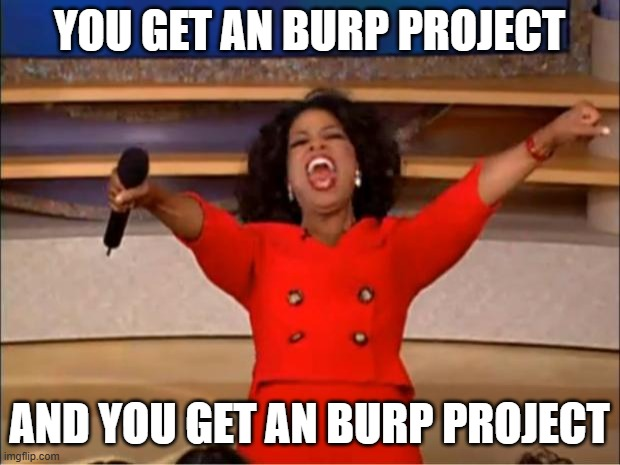

# Sharing Burp Projects without Secrets with Hackvertor
You want to share a Burp project with others without sharing tokens and secrets.

1. Install [Hackvertor][hackvertor] (you probably already have it).
2. Create a Hackvertor global variable.
    1. Click the `Hackvertor` in the menu bar (not the tab).
    2. Select `Global variables`
    3. Create a new variable named `token` (or anything really).
3. In Repeater, use `<@get_token/>` for the token.
4. When you're ready to share, modify the value of the global variable(s) from step 2 to some random value.
5. Create a copy of the project with just Repeater (or the tools you want to share).
    1. Click the project menu item.
    2. Select `Save copy`.
    3. Select the tools.
6. ???
7. Profit.

[hackvertor]: https://github.com/hackvertor/hackvertor

## Details
Recently, I was testing an API at work. Unsurprisingly, this API used an
~~AAD token~~ Entra ID token which is just a JWT.

Hint: If you get such a token, drop it into http://jwt.ms (it's a Microsoft
website) and the claims section will give a lot more info that the other site.

I had all the APIs mapped up in nice tab groups in Burp and I wanted to share it
with my team members so they can easily start poking the API. But I did not
want to share my token.

First I created a Hackvertor global variable. Click the `Hackvertor` in the
menu. There's also a Hackvertor tab, don't confuse these. Menu is the one on
top.



Then select `Global variable`.



Now you can create a new global variable. Let's name it `token` and assign it a
"real" value.



Use the Hackvertor variable in Repeater. You can reference a variable
like this `<@get_{variable_name}/>` which in our case will be `<@get_token>`.



After the API was mapped, I change the value of the `token` to something random.
You can also completely delete the variable and ask your team members to create
it again, but updating a value is easier.

Then I clicked the `Project` menu item and selected `Save copy`.



This allows us to create a copy of the project with just the Repeater tab.



And now you can share the project without any secrets.

## Other Benefits
This also works with secrets. Assume you have a client secret for getting a
token, you can share the APIs without the token using the same method.

This is also useful when tokens expire. Now you do not have to replace them in
Burp Repeater/Scanner for older tabs. You can just update it in Hackvertor.

## Limitations
This was done for a token that was valid for 24 hours and I was getting the
token using a different method that was not a web API, so I did not need to do
any automation. I mean, you could do automation, but I don't think it's worth it
for something you need to do once a day for a few weeks.

A lot of folks automatically update their tokens using Burp macros. There are
many blog posts showing how to do this. It looks like it's possible to update a
Hackvertor variable from an extension, but I have not dived into this.

See this [discussion on Twitter][twt] about updating a custom Hackvertor tag
from a Python script.

[twt]: https://twitter.com/fransrosen/status/1361594153268871168