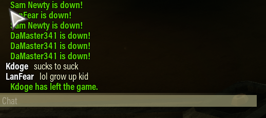

## Another save has more progress than your currently loaded save after creating a new save
I created a new save, now I had two saves, a `main save` and an `active save`.
Every once in a while the game would complain that my main active save had more
progress that the main save which is true.

How do I fix it?

1. Play a mission on the `active save` (I assume it will be the most progressed save) so the game creates an autosave point.
2. Select the `Load` option for the `Main Save` slot. You will get a loading splash screen.
3. Go back into `Options -> Save Menu`. Your `Main Save` should now also be `Active save`
4. Select the `Restore Save` button up top.
5. Brings up a list of automatic saves the game has recently generated. Look for
   the most recent time stamp with a `Save Slot` called `Backup #` where # might
   be 0, 1, 2, 3.
6. With your `Main Save` set as `Active Save` select the `backup` save you want
   to restore, the game will then ask if you are sure you want to use this save
   dad to overwrite your currently active player data. Select `Yes`.
7. There will be a brief loading splash screen. Now when you go and look at your
   save slots, you should see your Main Save has the most recent game progress
   data.
8. At this point you can either delete the save slot you had previously created,
   or you can just ignore it.

Source: [/u/Mad_Mechanic_280/ on reddit][save-src].

[save-src]: https://www.reddit.com/r/DeepRockGalactic/comments/n0xae4/main_save_vs_active_save_and_updating_existing/h1cfltb/

## Griefer Kdoge
Killed all of us before the pod launch. It does not accomplish anything other
than a lower payout for everyone which is a few hundred credits and not really
significant.

