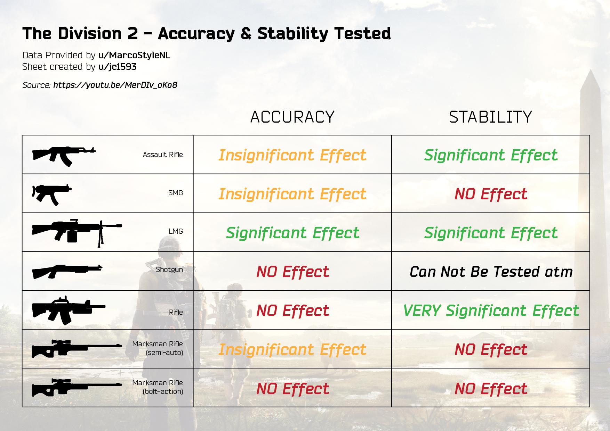

# Accuracy and Stability for Different Weapon Types
Please see the image for credit.

# Some Builds

* Critical Hit Chance (CHC) has a 60% cap. Switch the excess CHC to Critical Hit
Damage (CHD).
* The stats section in inventory is for weapon #1, swap to see it for the other.
* DTooC = Damage to Targets out of Cover

## Assault Rifle Builds
We need to make CHC high so we can kill things with it.

Specialization is usually Gunner for the ammo replenish.

Some builds use the handgun `Orbit`.

> Swapping from this weapon within 10s of killing an enemy grants 35% critical
> hit chance and 40% critical hit damage for 15s.

Burn down the enemies and then kill them with Orbit. Then you can kill them with
the assault rifle. If doing this, you can reduce your CHC a bit from the cap,
but I prefer to have it high anyways because swapping is not that great.

### Good ARs
Depends on your play style.

----------

## SMG + AR - Hunter's Fury
Similar to the AR builds, increase CHC to the 60% cap (or near cap), then burn
things down.

Specialization: Gunner

Main: SMG - `Dark Winter`. Get in close and spray.

> Perfect Killer:
> Killing an enemy with a critical hit grants +50% critical hit damage for 10
> seconds

2nd Weapon: You can another SMG, I use a `G36 AR with the Ranger talent`. This
is for killing targets further away from cover.

> Amplifies weapon damage by 2% for every 5 meters you are away from your
> target.

Pistol: `Orbit`, doesn't matter tbh.

Head: `Coyote's Mask` God roll with CHC mod.

Backpack: `Liquid Engineer` with armor, health and armor regen. If you feel like
you have enough armor for lower difficulties, switch to the Hunter's Fury
backpack for the 4-piece bonus. Mod: CHC.

The talent is pretty good for the SMG build because you will take a lot of
damage, but if you can keep up the killing tempo especially in Challenging and
below, you will never die.

> Perfect Blood Sucker:
> Killing an enemy adds and refreshes a stack of +12% bonus armor for 10
> seconds, Max stack is 10.

Chest: Red Fenris Group. This gives AR damage. Mod: CHD. Talent is Obliterate.

> Obliterate:
> Critical hits increase total weapon damage by 1% for 5 seconds.
> Stacks up to 25 times.

The talent helps increase damage from critical hits.

Hand, Holster, Knee: Hunter's Fury. Mod the main attribute to be weapon's
damage. If you got one, then mod the 2nd attribute to CHD.

Alternatively, you could swap the backpack to Hunter's Fury to get the 4-piece
bonus.

----------

## AR Build From YouTube
Source: https://www.youtube.com/watch?v=FIMK2Kyi3_w

Specialization: gunner

* Head: Providence - CHD/CHS, CHD mod.
* Chest: Providence - Sacrifice - CHD/CHS - chd mod - perfect glass Cannon or obliterate with normal prov Chest
* Holster: Ceska CHD/CHS
* Backpack: Providence - The gift - CHD/CHS - CHD mod - perfect vigilance talent
* Gloves - Grupo - CHD/CHS
* Knees: Overlord - Fox's prayer - CHD
* Police M4 - DtooC - ranger talent - try other talents
    * CHD muzzle + under barrel - extended mag - probably the last one is still CHD
* Orbit named pistol. - perfect finisher
* Skills: banshee pulse + shield with the secondary (shotgun)

----------

# Weapons
Depends on your play style.

## Rifles
`Baker's Dozen` is a good choice for further enemies as a mini-sniper. Add the
+5 rounds mod for the mag.

`The Virginian` and `Diamondback` are nice, but smaller magazines and slow
reload.

The Diamondback's bonus is great because you can hit the marked enemy
and one-shot the others. Allows you to switch your CHC to CHD.

> Agonising Bite:
> Diamondback randomly marks an enemy. Hitting that enemy
> consumes the mark, guaranteeing a critical hit with damage amplified by 20%.
> After hitting a mark, all shot fired are guaranteed critical hits for 5s. A
> new random enemy is marked afterwards and whenever you reload.

## Snipers
`Mantis` is a great choice with the decoy. Headshot kills refresh the decoy
cooldown period.

## Light Machine Guns
These are great if you want to unload a ton of bullets.

`Pestilence` puts a DoT on targets, this jumps to others when they die.

`Sleipnir` is also a good choice.