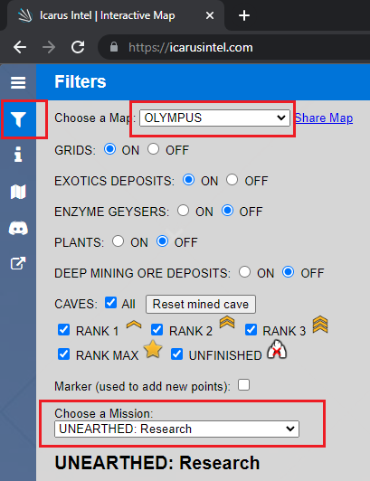
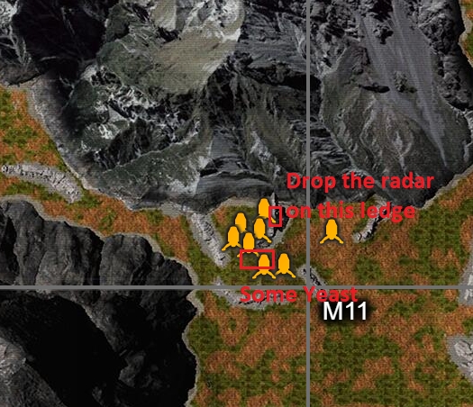
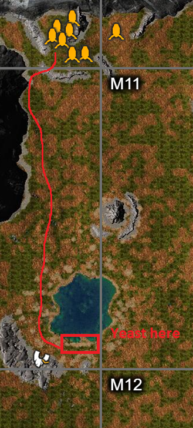
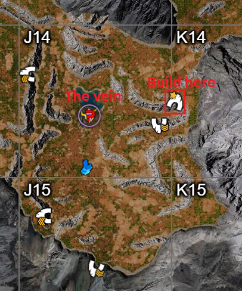
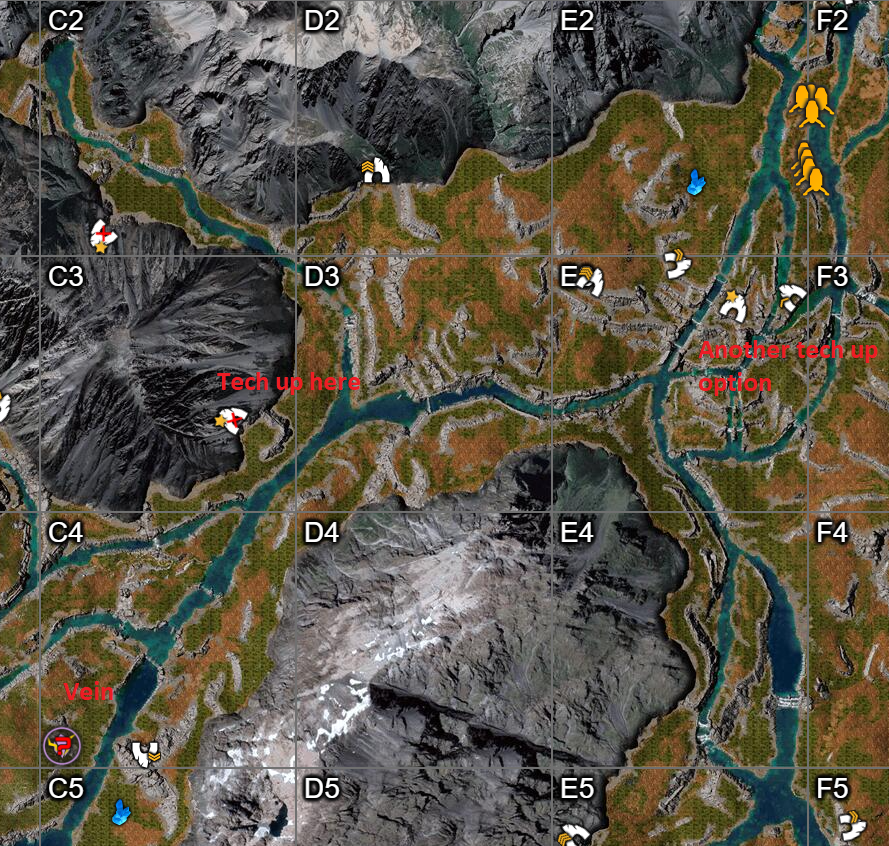
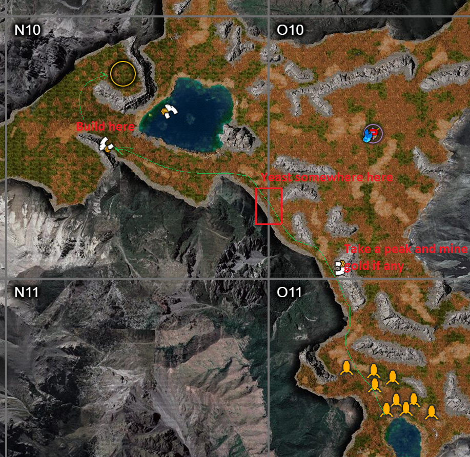

Icarus ([Steam link][icarus-steam]) is a session-based survival game. You have
to start from scratch in every session. There are some workshop items that you
can buy and take with you (up to 15 items) that make the startup much faster.

[icarus-steam]: https://store.steampowered.com/app/1149460/ICARUS/

# Good Workshop items
Note there are two costs associated with each workshop item. First we need to
research the item and then pay another fee to craft it. You get the actual item
after crafting. After the first research, you can just keep crafting.

Items are lost if they are left on the planet. You need to bring them back with
you either in your inventory or in the dropship cargo slot when you are leaving
a mission.

If your items break, they are magically repaired when you take them back to the
station. **Don't throw away workshop items**.

1. Canteen: Drink once and it will refill the canteen. You don't need to worry
   about water for a long time. It also reduces your body temperature which is
   useful in the desert.
2. O2 Canister: Build a `Crafting Bench` and then build an `Oxite Dissolver` to
   fill it with Oxite and Sulfur.
3. Knife: These increase the skinning yield which give you more Leather and Fur.
   The original `MXC Knife` is a good start. As you get more Ren, move to
   `Qie` knife for skinning speed and better yield.
4. Pickaxe: Not only they have better mining yields, they break later.
   `MXC Knife` and then `Heike` are good starting pickaxes. Later down the road
   you want to go for the `Neves` pickaxe.
5. Envirosuit: `Duo` is a good start to open up but go for `Hark`.
6. Armor: When you get some Exotics, open (but not craft) the line towards the
   left and get one of the `Bihu` or `Dongtian` envirosuits. Then craft the
   Naneo armor which only need Ren. THIS WILL HELP ALOT.
    1. Later you want to go for the `CX-400` armor for the Ore yield.
7. IC-001 Radar: It has its own power source and makes finding Exotic veins
   easy. You can also use it like a "wildlife attraction" module to get them to
   come to you and kill them for meat, fur, leater, and bone. Makes the initial
   grind for these easier.
8. Mass Dampener Module: Increases speed. When you get an envirosuit with slots,
   buy a few (they stack). They are very useful for Exotic farms because a lot
   of your time is spent running between veins and the dropship.
9. Backpack: The initial `Survival Backpack` is super cheap and awesome. Later
   you can specialize. I use the 12 slot backpack now.
10. Biofuel Can: For mining Exotics, it's more than enough to run the
    `Biofuel Generator` to extract three veins.

# icarusintel.com
Great website at https://icarusintel.com. Choose the `filter` icon (2nd from the
top) and then select the map and mission to get the info including the location
of caves (and their rank) along with possible location of veins.

# Routine for Tech Up Missions
These are missions where I usually need to tech up to a certain tier or I am
just farming Exotics. I usually tech up in a star cave near the target location
or the nearest star cave to the drop pod.

Note I have some workshop items like armor, pickaxe, axe, knife, canteen, O2
canister and speed modules.

1. Grab all your stuff from the pod. Press the interact button while facing it
   and click `Take All`. This will put on the armor and put things in the
   hotbar.
2. Grab some sticks and stones to make a wood bow if I do not have my Larkwell Bow.
3. Drop the workshop radar if I want to farm Exotics. This also helps attract
   wildlife for food, etc.
4. Make some stone arrows.
5. Move to the target location if I need to build something. Usually a big cave
   (star or rank 3 based on icarusintel.com). Drink some water while going
   there.
6. Kill some wildlife to get some stuff.
7. Make a `Bone Sickle` and some `Bone Arrows` (kill cave worms faster).
8. Mine some Sulfur, Oxite, Silica and Yeast (make sure farm Yeast with the
   sickle for much higher yield) while moving to the target location.
9. Make `Crafting Bench`.
10. Mine stone to make `Oxite Dissolver`, `Camp Fire` and `Stone Furnace` (2x)
   (you can use the workshop furnace for one).
    1. Fill up the canister in the `Oxite Dissolver` with some Oxite and Sulfur.
       Now you don't have to worry about Oxygen for a looong time.
11. Make some antibiotics with `Charcoal` (from the campfire), Yeast and Silica.
   These help reduce the duration of Pneumonia from being in the cave.
11. If I got some meat that can be dried up, I make a `Drying Rack`. This helps
    give me three types of food for buffs. Berries for Staming (or cooked meat),
    Cooked Prime Meat and Dried meat. Plus dried meat lasts for a much longer
    time than cooked versions.
12. Mine 80 Iron Ore (this is usually more than two nodes) and smelt them in the
    furnaces. Mine Oxite
13. At 40 Iron, craft the `Anvil Bench`.
    1. Craft `Iron Pickaxe` if you do not have a workshop one.
    2. Craft `Longbow` if you did not bring the workshop bow.
    3. Craft `12 x 10` Iron nails for the `Machining Bench`.
14. Farm enough `Fiber` (use the Sickle) to make 40 `Ropes` at the crafting bench.
15. Craft the `Mortar and Pestle` and put it on the bench. In it do:
    1. If you have the talent to convert wood to sticks (and be sure to take it).
    Create 800 sticks (use `40` as the number in the crafting menu because each
    wood creates 10 sticks). Put all the sticks in the Mortar and Pestle.
    2. Craft 200 `Tree Saps`.
    3. Craft 50 (or more) `Epoxy` as you can from Tree Saps (4) and Sulfur (2).
16. Make the `Machining Bench`.
17. Craft the `Cement Mixer`.
18. Make 20 `Concrete Mix`: 20 Tree Sap, 160 Stone, 80 Silica.
19. Make `Concrete Furnace`.
20. Start melting `Gold Ore` for `Electronics`.
21. If you're going for the `Biofuel Generator`: Make 30 Concrete Mix.
22. If you did not bring the workshop biofuel can:
    1. Make `Biofuel Composter` and a `Biofuel Can`.
    2. 100 Tree Saps (that's 400 sticks) and 400 sticks can fill one can. You
       generally only need one for the generator.
23. Mortal and Pestle:
    1.  Craft 12 `Carbon Paste`. 8 for `Fabricator` and 4 for the`Electricity Tool`.
24. Electronics:
    1. 30 Electronics for the Fabricator.
    2. 12 for the Biofuel Generator.
    3. 5 electronics per Extractor.
        1. If going for Spirit, make 30 ish here which is more than enough.
25. While mining, mine 60 `Platinum Ore`. We can use it to make a Platinum Axe
    when the workshop one breaks. Or you can keep using the Iron Axe.
26. Make 21 steel. Make Steel Bloom from Iron Ore+Coal or Iron ingot+Ore in the
    Mortar and Pestle and then cook in the Concrete Furnace.
    1. 100 Steel Screws in the Machining Bench: 1 Steel.
    2. Biofuel Generator: 20 Steel.
27. Craft the Fabricator.
28. Craft the Biofuel Generator and Electricity Tool.
29. If going for Exotic farming, **Do not craft Extractors**.
    1. They go in the `Carry` slot which is where your workshop radar is.
    2. We will take 5 Electronics and 20 Iron for each extractor.
30. If you want to make stone buildings by the vein, make the `Masonry Bench`
    (20 kg) and take 200 Iron Nails and Leather with you.
    1. We can deploy the bench at the destination and only need wood and stone
       to craft the pieces. The bench is lighter than the items.
    2. You don't need to make stone floors for the actual shelter floor.
    3. If you're not worried about Snow, you can get away with using floor as roof. So make:
        1. 4 Stone floor for roofs. 8 Stone walls.
    4. If you need proper roof for snow because snow will break floors as roof:
        1. 8 Stone walls. 4 Stone wood/ramp. 4 Stone Wall Angled.
31. Before leaving the first tech up cave:
    1. Fill up the O2 canister again.
    2. Grab as much food as you can.

## Payday Extraction
I can do this in 2 hours for 180-200 Exotics ([EIP Guide][eip-payday]). I
usually run the mission on Easy because it only affects the payout (200 Ren) and
not the Exotic amount from the vein.

[eip-payday]: https://eip.gg/icarus/guides/payday-extraction-mission-walkthrough/

1. Drop the workshop Radar on a ledge. This way the animals cannot reach the
   radar. They will stop aggroing when the scans complete and you can pick them
   off one-by-one.
   
2. Scan the area to see if the vein is in J14.
3. If the scan results contain both the veins in J11 and J14, it's almost always J14.
    1. If the result is J11 or I10, it's almost always very obvious.
4. If it's not J14, go away.
5. Kill the animals that came for the Radar. Make a bone sickle, harvest the
   Yeast near the entry into the ledge (see the image above).
6. If J14, run to the star cave at K14. Mine Silica, Sulfur and Oxite on the way.
7. If you did not harvest Yeast, there's some by the South the lake in L11.
   
8. I do most of my building in the start cave in K14.
    1. As you can see, there are multiple caves around if we need more mats (usually gold).
    
9.  If you need to run to the one at the edge of J14, it's a good idea to craft
   the shelter at the Masonry Bench and take it with you to drop it by the vein
   on the way.
    1. I usually make 8 stone walls, 4 stone floor (for use as roofs) and one door.
11. Make 57 Electronics:
    1. Fabricator: 30
    2. Biofuel Generator: 12
    3. Three extractors: 15
12. Make 12 Carbon Paste:
    1. Fabricator: 8
    2. Electricity Tool: 4
13. Make 21 Steel:
    1. 100 Steel Screws: 1 Steel
    2. Biofuel Generator: 20 Steel 
14. Make the Biofuel Radar in the Machining Bench. This is needed for the
    mission reward (if you want the Ren but you probably already have the
    materials for it). You can destroy it immediately after that.
15. After making the following, grab these and go for the vein:
    1. Fabricator
    2. Biofuel Generator
    3. Materials for Extractors
    4. Electricity Tool
    5. Masonry Bench and Iron Nails/Leather for the stone structure.
    6. Bed Roll.
    7. Food.
16. Drop a Thatch Building with Masonry Bench. Mine enough stone and wood to
    make 4 Stone floors and 8 Stone walls.
17. Make 4 Wood floors. This will be the base of the building. Complete it with
    the Stone walls and use the Stone floors as roof.
18. I usually like to build right by the vein.
19. Drop the Bioefuel Generator and Fabricator. I like to put it in the shelter
    closest to the vein.
20. Put the Biofuel Workshop can in the generator.
21. Put the workshop Radar in the Fabricator. You can only carry the Extractors in the carry slot.
22. Create three Extractors and put them on the vein. This vein takes three
    extractors (see icarusintel.com for info on other veins). Make sure you do
    not drop them outside of the carry slot after dragging them from the
    Fabricator inventory. They will get lost if it happens.
23. Use the Electricity Tool to make a junction (click on the ground outside the wall by the generator.
    1. Connect the junction to the generator.
    2. Click on the junction with Electricity Tool again and connect it to each
       of the extractors.
    3. Select the Biofuel Generator and `Activate` it.
24. Grab the workshop Radar from the Fabricator.
25. Deploy it on the ledge by the vein and activate it.
26. Wildlife might attack both the Radar and the Extractors.
27. This will scan the vein. If we made the Biofuel Radar before, this will
    advance the mission objectives.
28. Hang around while the extractors finish the job.
29. **Grab the workshop Biofuel Can from the generator.**
30. Grab the Exotics, if it's close to sundown (18:00), sleep.
31. Run back to the pod.
32. **Make sure to put the Exotics in the Dropship cargo slot in this mission.**

## Spirit Walk: Exploration
This map is used for Exotics mining. There are three veins. I run it on Easy
because there's no payout and difficulty does not affect the number of Exotics
in a vein. You can usually figure the general location by the first scan after
landing.

1. Drop the workshop Radar and scan. This will give you a general idea of where
   the veins are.
2. If the vein in C4 is not active, I usually go away and reset the mission.
3. If the vein in C4 is active but I see the L12 and M14 veins active, I also go
   away. They take a long time to run.
4. Go to the star cave in C3 to build up. The star cave in C2 is a backup for
   bad RNG (e.g., not enough of a certain node like Gold).
   1. Another option is the star cave in E3 with three move backup caves.
   
5. Build up to these:
    1. Fabricator
    2. Biofuel Generator
    3. One filled Biofuel Can if you do not have the workshop one.
    4. 30-ish extra Electronics and 60 (or more Iron ingots).
    5. Electricity Tool.
    6. Caveworm Bow and a ton of arrows.
    7. Masonry Bench.
    8. 150 ish Iron Nails for Stone shelter.
    9. Food and filled O2 Canister.
    10. Medium Iron Crate.
    11. Platinum Pickaxe.
6. The rest is monotonous:
    1. Run to the vein.
    2. Mine some wood and stone for 4 stone roof and 8 stone walls (you could go
       down to 2 roofs and 6 walls if you want a smaller place).
    3. Drop a Thatch 1x1 shelter. Make the stone structure.
    4. Drop the shelter and make Extractors with the Fabricator. Usually the
       vein is near a cave where you can make the extra Iron ingots.
    5. Mine the vein while you hangout. I usually like to kill the wildlife and
       make some food or make a Crafting Bench and the Oxite Dissolver to fill
       my O2 canister.
       1. If you're worried about Oxygen. You can mine Oxite and put it on your
          suit while the veins are extracted to conserve the O2 canister. Make
          sure to pick it up after you start moving.
    6. Run back to the pod with Exotics. Drop the Iron Crate by the pod to store
       the extra Exotics.
    7. Keep a single Exotic in my inventory because I have the speed talent when
       carrying Exotics.
    8. Run back to the previous extractor location and grab the stuff. If you
       have extra space, grab some of the Stone walls and floors. If not, no
       biggie. You can always create nails at the next vein in a nearby cave.
    9. Destroy the Extractors to get some material back.
    10. Go to the next vein.
7. I usually start with the C4 vein.
    1. This veins needs three Extractors.
    2. After it's done, I destroy the Extractors and get 6 Electronics and 30 Iron ingots back.
8. There's usually enough weight limit to take everything.
9.  Run back to the pod. Drop these in the pod:
    1. Exotics
    2. Workshop Pickaxe: By this time it's usually broken.
10. Drop the Iron Crate by the pod. This will be used to keep your extra exotics
    later.
11. Rinse and repeat until three veins are done.
12. After the last vein is done you can just grab the Exotics and run for the ship.
    1. **Make sure to grab your Workshop items.**
13. **Make sure to keep one Exotic on you at all times if you have the speed talent while carrying Exotics.**
14. Before lifting off, make sure:
    1. You have all your workshop item from the crate and from the field. At
       this point if you have left the Biofuel Can, you can let it go because
       it's cheap but hopefully you still have your radar or the expensive
       items.
    2. Grabbed all the Exotics from the Iron Crate and put them either in your
       own inventory or in the drop pod's cargo slots.

## Homestead: Construction
I usually do it to farm Ren. At Hard with Hardcore it pays 400 Ren and usually
takes me around 45-50 minutes. Bring the workshop Furnace, no need for the
radar.

1. If near the lake, drink.
2. Go up towards the cave in N10 and parallel to the cliffs. Make bow and arrows.
   
3. If the cave at the edge of O11 is open, take a peak and mine 20 Gold ores if you see a node.
    1. This is to make sure you have enough ore for the two statues.
4. Kill some wildlife, enough to make two `Rustic Beds`.
5. Harvest some Yeast around the edge of O10 and N10 by the cliff (see image above).
6. Mine 50 ish Sulfur and Oxite and any Silica you can find (you need around 100 total).
7. Build in the N10 cave.
    1. We will not need to leave the cave for the most part.
    2. No need to make a bedroll, you can use a Rustic bed instead
    3. Antibiotics are useful.
    4. Crafting Bench.
    5. Mine 80 Iron ore immediately and start melting in the workshop furnace.
    6. Make a stone furnace to help with the iron melting.
    7. Make Oxite Dissolver and replenish the O2 can. 50 Oxite is more than enough here.
    8. At 40 Iron ore make the Anvil Bench.
    9. Make Machining Bench.
    10. In the meanwhile, farm 80 Silica and 160 + 200 stone for the Concrete Mix.
    11. Make Cement Mixer.
    12. Make 20 Concrete mix.
        1. 20 Tree Saps.
        2. 160 Stone.
        3. 80 Silica.
    13. This will take a few minutes, if you do not have 20 Gold ore in this
        cave or did not find any, go around and mine them.
    14. Grab your workshop Furnace.
    15. Make Concrete Furnace.
    16. Melt 10 Gold Ores.
8. Craft Fireplace in the Crafting Bench and put it in the Rustic Bench. Needs
   120 Stone!
9.  Deploy the Rustic Bench and craft (you will need mostly wood with some Iron
   nails and 10 Gold ingots):
    1. Bookshelf.
    2. Large Couch.
    3. Medium Couch.
    4. Large Dining Table.
    5. 6x Dining chairs (make sure to choose dining chairs).
    6. 4x Nightstands.
    7. 2x Rustic Beds. Use one instead of a bedroll in the cave.
    8. 2x Rustic Statues (need 10 Gold ingots).
11. Grab everything and the Fireplace. Drop everything else except workshop
    stuff. You should be at almost maximum weight limit. Otherwise, grab any
    wood that you have.
12. Go to the blue circle above the ledge until you get the Sol soundbite and
    the first objective completes.
13. Make a 3x3 house, it can be Thatch but I prefer wood in case a storm starts
    while I build. You will mostly need wood and fiber which are plentiful up
    there. You will need:
    1. 18x wood floor (you can go 9x Wood floor for roof and 9x Thatch floor).
14. Put everything together.
15. **Check that you have your workshop Furnace with you, otherwise grab it on the way back.**
16. Run back to the pod and check you have everything with you.
17. Lift off.

# Hotbar Slots
I usually have them in this order:

1. Pickaxe
2. Axe
3. Bow
4. Knife
5. Sickle

Everything else after this is fluid. Sometimes I make a stone pickaxe to open entrances to the caves or mine stone instead of using the workshop pickaxe so it goes into 6.

Ctrl+clicking an item in the inventory while not interacting with an appliance
(e.g., crafting bench) will put it into the hotbar. This is useful for placing
items. Ctrl+clicking the hotbar item to put it in your inventory.
